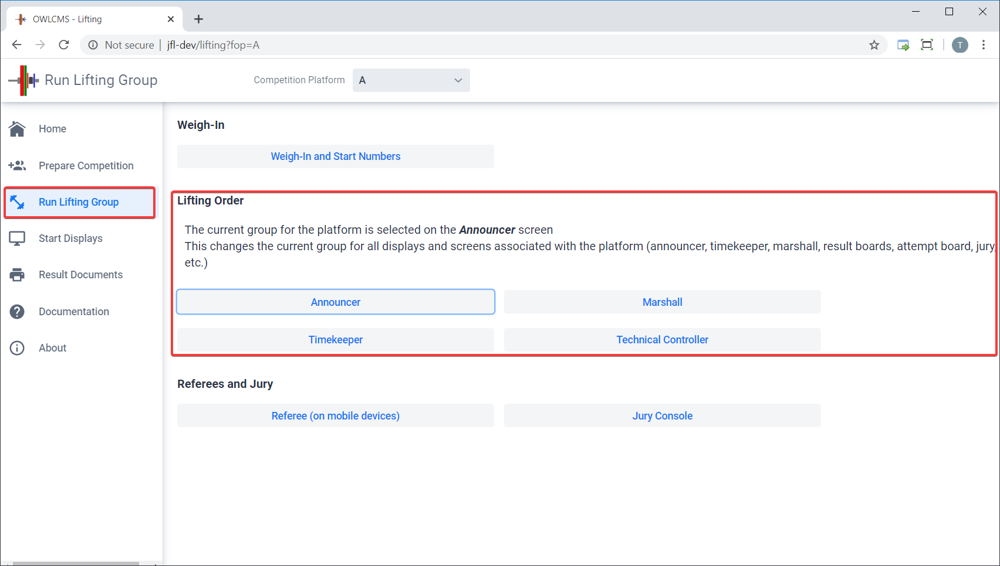
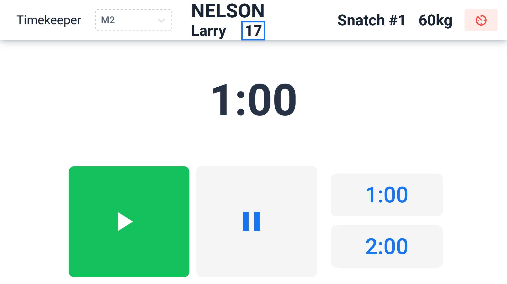
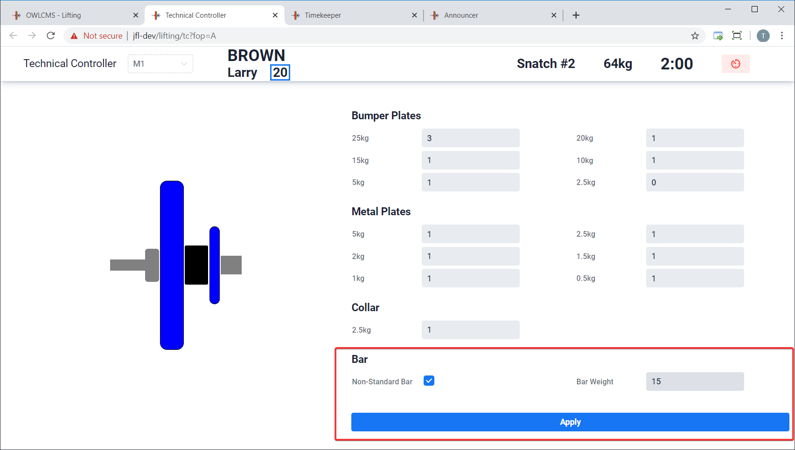

After a group has been weighed-in, the actual process of running the competition takes place from the various Technical Officials screens which are started from the `Run Lifting Group` page.

The first thing to do is to check that the correct field of play (platform) is displayed at the top of the page (and if not, to select the correct one.

## Selecting the current group

The **announcer** screen acts as a master to select which group is competing.  When the announcer selects a group, all displays for the field of play switch to that group.

## Announcing an athlete

OWLCMS automatically shows the next athlete to lift. 

Following the IWF rules, the following events should take place

1. The announcer asks: "Loaders, please load 62kg on the bar"
2. Once the platform is clear, the announcer says, in the local language then in English: "The bar is now loaded with 62kg for the first attempt of Larry BROWN"
3. When pronouncing the family name of the athlete in English, [start the clock](#starting-the-clock)
## Starting the clock

3. Click on the Right-Arrow button to start the clock.  The announcer can act as timekeeper and start the clock herself, or alternately a separate person acting as timekeeper can do so.  We recommend that the announcer start time even when a separate person is acting as timekeeper, since that eliminates confusion.

## Stopping/Restarting the clock

The announcer (if acting as timekeeper), or the timekeeper (using the timekeeper screen), can stop the clock when the bar leaves ground.  They both can restart the clock if the bar is put down not having travelled above the knee.

## Manual Refereeing

If no refereeing devices are being used, the announcer captures the decision given using flags, cards or hand signals.

## Announcing the decision

When a decision is entered (whether manually by the announcer, or automatically by referees using refereeing devices), a confirmation is shown for five seconds.

## Declarations and Weight Changes

The announcer may act as marshall and be told of declarations and changes.  Weight changes are entered by clicking ONCE on the the athlete's name.  The athlete's card then pops up. Hitting "Enter" is the same as clicking "Update".

Notes:

- In order to reverse a ruling, edit the bottom row which is the actual weight that was lifted or failed (negative number).  Changing "62" to "-62" would mark the lift as failed.
- In order to mark a lift not taken (such as a withdrawal), put "0" in the bottom row.

## Weight Change for Current Athlete

If a [marshall](#marshall) is present, it is possible that a weight change occurs for the athlete currently announced. If that is the case, a notification is shown on the announcer screen.

## Breaks

In order to change the displays to show countdown timers for a break (time before introduction, time before first lift, time before first clean-and-jerk, etc.), use the Break button.

Select which type of break. For time before start and time before C&J you can select a statutory duration.  If instead you are calling time before the next introduction according to schedule, you may use the TARGET option and set time.  

## Marshall

In larger competitions, a separate Marshall desk is set up in the warm-up area.  The Marshall screen is identical in operation to the announcer screen, except that the Marshall cannot start/stop the clock and manage breaks.  

Useful tip: you can use the filtering box to quickly locate an athlete (here we have three lifters with Jackson as the last name)

As explained in the ""

## Timekeeper

The timekeeper screen operates like the announcer screen.  Both the announcer and timekeeper can start and stop time.  It is often less confusing if the announcer makes sure the platform is clear before announcing, and starts time herself.  The timekeeper can then take over and watch for the bar leaving the plaform and going above the knees.

## Technical Controller

In school-age kids competitions, it is often the case that a non-standard bar is used (say 10kg) or that large lightweight bumper plates (2,5kg or 5kg) are used.  Since loaders are not used to such setups, it is useful to refer to the attempt board graphical display.

The technical controller screen is used to match what is on the platform.  Once `Apply` is clicked the attempt board(s) is updated with the proper graphics.

This has no incidence other than the graphics shown on the attempt board.

