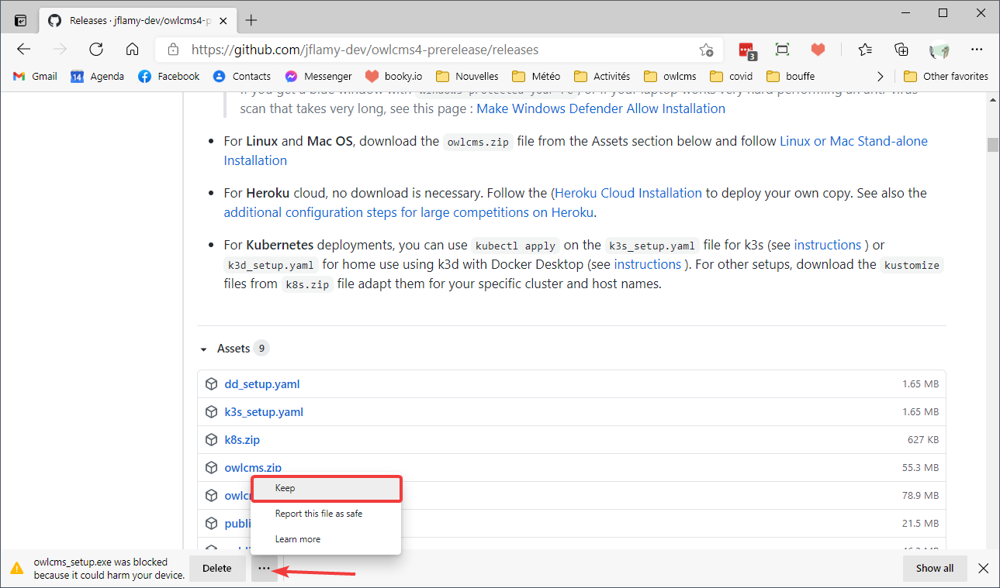
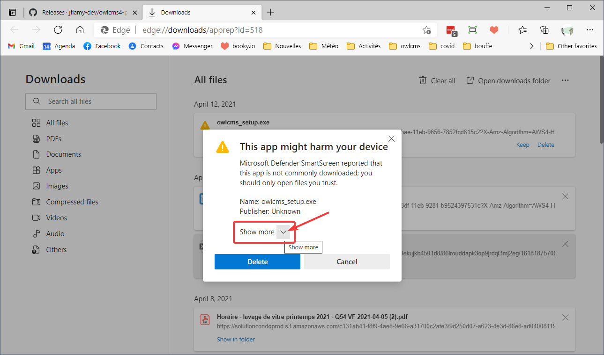
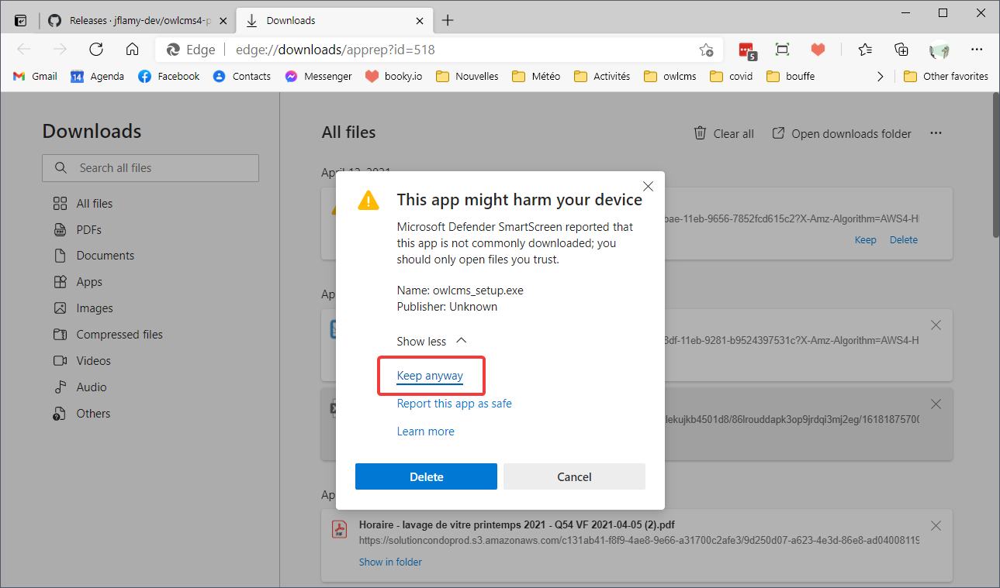

## Dealing with Protection Warnings

Microsoft has a very strong commitment towards protecting your PC from viruses.  Unfortunately, their process a little bit over-dramatic.  If you care, go to [bottom of this page](#why-are-there-warnings-anyway) for an explanation for the warnings why they can safely be ignored. 

If you just want to install, read on.

## Downloading with Chrome or Firefox

If you download with Chrome or Firefox, you will see a blue box like the following when you double-click on the file to open.  **Click on the `More info` link.**

This will make will make a `Run Anyway` button appear at the bottom. You can then **click on `Run Anyway` button to let installation proceed**.

## Downloading with Edge

Edge is the default browser on Windows.  With it, one might say that Microsoft has gone a touch overboard.  See for yourself.

1. Go to the releases page and click on the download link. Note in passing that Microsoft owns the Github site and could very well scan the executables there.  But if we click, we get a first menacing message "was blocked because it could harm your device".

   **Click on the `...`  button and select Keep**

   

2. But then comes a second warning.
   **Click on `Show More`**
   

3. **Click on `Keep anyway`**

   

4. You should finally see the file downloaded, and be able to click on it to open.

   

5. But wait!  If you go through the downloads folder instead and double-click on the file, you are actually going to need to go through the steps described for Chrome and Firefox above...

## Why are there warnings anyway?

In the past, owlcms was signed with a certificate attesting to the author's identity, but this is not enough for Microsoft to trust the program.  For the warnings to go away, one of two things would need to happen

- either a very large number of people download the program from the same source and Microsoft ultimately figures out it is innocuous, or
- a 500$ code-signing certificate is bought to actually bypass the warnings , or

Funny thing is that the program is stored on GitHub, which Microsoft owns.  And they could very well scan the software for viruses there, but they don't.  And instead of trusting their own URLs they give every release a different URL, so Microsoft never gets to learn that it is safe, and signaling it as safe is a waste of time for the same reason.  I have not found an alternative file hosting service that Microsoft trusts.

If some kind soul donates the money, I'll do the certificate song and dance, until then, we have to bear with the inconvenience.

## Is there a real risk?

Well, no.  The windows program you are downloading is a very simple packaging that just makes it easier to install the app.  Inside the packaging is the exact same program that runs on Mac, on Linux, and in the cloud on Heroku or Kubernetes.  There is simply no Windows-specific code in there, and the program runs without any special privilege whatsoever.