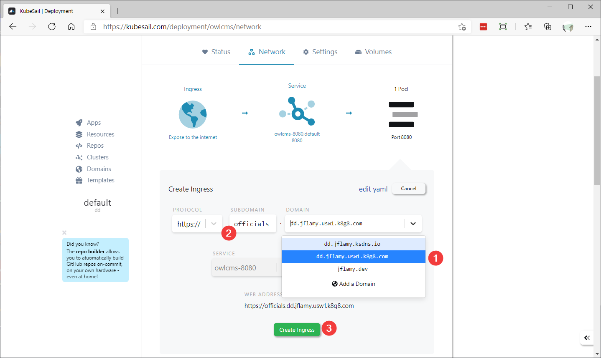
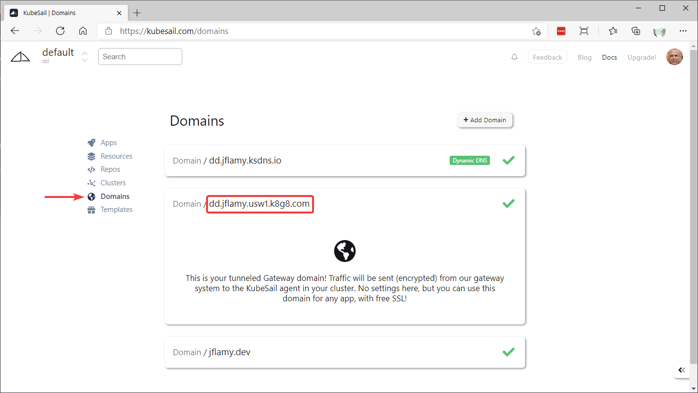
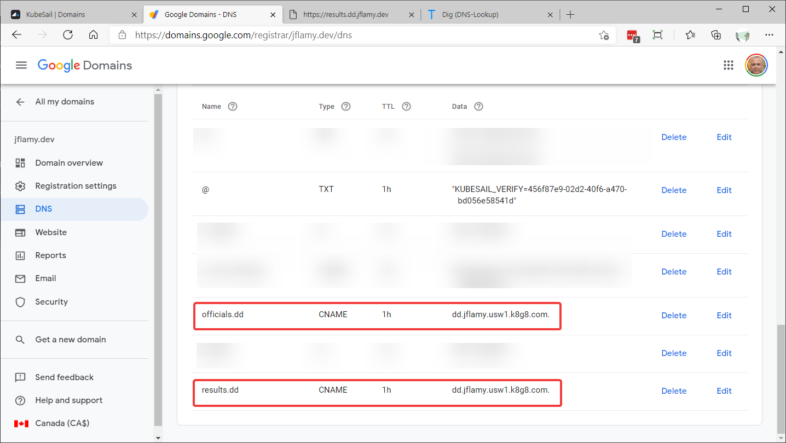

# Home Hosting with Secure Internet Access

As an alternative to Heroku suitable for larger competitions, this page explains how to run owlcms and publicresults on your own Windows computer, and make it available from the cloud.

This procedure uses the free tier of the https://kubesail.com service to make the program accessible from the cloud, and handles the tricker parts necessary to ensure the use of the secure https protocol.  There are other enhanced services available, such as taking backups, for a small monthly fee.

## Install DockerDesktop

The instructions are found [here](https://docs.docker.com/docker-for-windows/install-windows-home/). This step is only required once.

## Owlcms Install

Docker Desktop installs the `kubectl` utility that is used to control Kubernetes.  By default, it will manage your Docker Desktop cluster.

This step installs owlcms and its prerequisites into the Kubernetes cluster.  It does NOT configure the internet access, this is done in the later steps.

```powershell
kubectl apply -f https://github.com/owlcms/owlcms4/releases/35.1.0-rc03/download/dd_setup.yaml
```

## Link the cluster to KubeSail

KubeSail offers a free service that will enable you to connect your private cluster to the cloud.  Your cluster will connect to KubeSail using an *agent*.  This works without changing anything to your firewall (since it is the agent running on your home network that initiates the process).

1. Create yourself a KubeSail account.  This will actually use a site called GitHub to log you in.  Beware that if you do not own an internet domain, the login you chose will be part of the URL people see, so you probably want something meaningful, such as your club or federation name.
2. Go to the Clusters page.  You will be given a command to install the agent.  Use the copy button to copy the command.
   

3. Paste the command in a command shell on your machine.
4. After a few seconds, the Cluster page will refresh and you will be asked to give a short name to your cluster.  This short name will be added to the front of a long name.  We suggest something short like "dd" or "owlcms".

## Configure the Internet Name

Modern web applications use the https protocol to protect privacy.  Not using this protocol causes an irritating warning in the browser.  However, using this protocol requires using a registered name in order to obtain the certificates used to encrypt the traffic.

If you own your own domain name, skip to [Alternative 2](#alternative-2-you-own-a-dns-domain) below.

#### Alternative 1: You do not own a DNS domain

KubeSail provides a built-in domain for each account, so you can immediately use that.

1. Go to the Apps section.  In Kubernetes an application is part of a "Deployment".  The `owlcms` deployment makes the application used by officials available.  We select that deployment, and click on the globe to make it publicly visible.

2. We now select the name under which our application will be visible.

   In the drop down we <u>must</u> select the name that ends with `k8g8.com` ; if not, things simply won't work.  In this example, we type `officials` as the subdomain name and the application will be reachable as `https://officials.dd.jflamy.usw1.k8g8.com`

   

3. KubeSail then issues the configuration update, and our cluster will automatically ask for a certificate from the LetsEncrypt service.  The URL should start working in about a minute.

4. Repeat the same steps for the `publicresults` deployment.  A short prefix like `results` would work.

   

#### Alternative 2: You own a DNS domain

1. Go to the Domains tab of the KubeSail interface.  Locate the k8g8.com fully qualified name. <u>Important</u>: you want the `k8g8.com` name, and not the other ones.
   
2. Go to your DNS providers.  Create two CNAME records that point to the k8g8.com fully qualified name.
   
3. Go to the Domains tab on the KubeSail application.  Click the "Add a domain" button and follow the instructions.  This will require you to create a TXT record in your DNS manager.
   
4. After a little while, your domain should show up in the  Domains list as being verified.
5. You can now create the connection between the name and the application. KubeSail calls them "deployments" following Kubernetes usage.  Go to the Apps section of KubeSail and select a deployment. We will use publicresults for our example -- this is the application used by the public.
   
6. We select the name of our domain, and we use the subdomain name we defined earlier as a CNAME.  So the resulting URL will be `results.dd.jflamy.dev` in this example.
7. When we click "Save", KubeSail will apply the new definition, and our cluster is set up to request the certificate automatically using the LetsEncrypt service.  After about a minute, the URL should start working.
8. Repeat steps 4 to 6 for the `owlcms` deployment. In our example we would use the `officials.dd` CNAME.

## Install Lens as Kubernetes Management Tool

Lens is a very useful tool to see the status of your cluster.

1. Download and install lens from [Lens | The Kubernetes IDE (k8slens.dev)](https://k8slens.dev/)
2. Create a cluster definition using the + at the left and select the configuration file in the `.kube` folder in your home directory, i.e.  `%HOMEDRIVE%%HOMEPATH%\.kube\config` 
3. Right-click on the icon for your cluster, select `Settings` and scroll down to the `Metrics Stack` section.  Install.

Once you have defined your cluster, the Terminal window creates a PowerShell that automatically uses the `KUBECONFIG` for that cluster, meaning that the `kubectl` commands will automatically go to that cluster.

## Backing up the database

In order to backup the database, you can use the `kubectl exec` command to reach the Postgres pod inside the cluster, as follows, using PowerShell, bash or Git-Bash.

```
kubectl exec $(kubectl get pods -l app=postgres --no-headers -o name) -- pg_dump -U owlcms -d owlcms_db
```

The part between `$()` is a sub-command that gets the name of the postgres pod, which is then substituted in the `kubectl exec` command.   You can add additional parameters to pg_dump to select the format you want.

