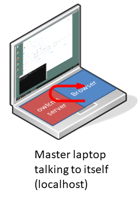

## Physical Setup

OWLCMS is a web-based application. This means that each screen or display is attached to a laptop or miniPC (Windows, Linux, ChromeOS)., and that a browser such as Chrome or Firefox runs on each computer.

**You can start by using a single laptop to run a club meet** (see below for [examples](#local-access-over-a-local-network).) 

At the opposite end of the spectrum, a full setup for a state competition using refereeing devices might look as follows:

You can also add a jury laptop with 5 refereeing devices, add additional results displays, as many as you want.  You can even replicate the full setup on multiple platforms, all running at once.  In all cases, there is only one OWLCMS primary server (either a laptop running locally, or a cloud application) 

## Computer Requirements

- The server software will run either 
  - on any reasonably recent laptop (this laptop will act as a primary server in a local networking setup, see [below](#local-access-over-a-local-network) for details.  In our experience, a Core i5 or equivalent is plenty.
  - or on a cloud service. We test and support the [Heroku cloud service](Cloud#Heroku), which has a free tier suitable for owlcms. See [below](#cloud-access-over-the-internet) for more info.
- For the user interface and displays,  It is recommended to use a recent version of **Chrome** or **Firefox** on a **laptop** or **miniPC** (Windows, Mac, Linux, ChromeOS). 

  - The cheapest solution to drive TVs and projectors is a [**Raspberry Pi** 3B](https://www.canakit.com/raspberry-pi-3-model-b-plus-starter-kit.html) that costs less than 75$ fully configured including cables and storage.  Refer to this [section](RaspberryPi) for tips .
  - For the officials, you can use just about any laptop.  Refurbished Chromebooks or refurbished Windows laptops work well -- all that is needed is the ability to run a recent version of Chrome or Firefox.
  - Apple iPhones and iPads are ok as [mobile refereeing devices](Refereeing#mobile-device-refereeing).   Display features such as the Scoreboard do work.
  - Android phones and tablets work fine for all features (just install Chrome)

## Sound Requirements

#### Chrome configuration

Recent versions of Chrome no longer allow web pages to emit sounds by themselves.  In order to hear the signals from the clock and the down signal, we have to override this setting.

- in Chrome, go to page ``chrome://flags``  and search for ``autoplay policy``  in the search bar.
  Set the parameter to ``No user gesture is required``

- OR --  Create a shortcut to chrome and add the following flag `--autoplay-policy=no-user-gesture-required`

#### Primary Laptop Sound

Some combinations of browser and operating system produce garbled sound. If that is the case, you may want to use the primary laptop to produce the sound (and wire your speakers to the audio output of the primary laptop.)   See [these explanations.](Preparation#associating-an-audio-output-with-a-platform)

## Networking Requirements

There are three ways to use OWLCMS: cloud-based, local, and solo.  Which one you use depends on your circumstances, please read on.

### Cloud access over the Internet

In this setup, OWLCMS executes on an external cloud service (we provide [instructions for Heroku](Cloud#Heroku), which is physically hosted on Amazon AWS).  Nothing is installed locally: all the laptops and miniPCs simply run a browser, which connects to the remote site.  The address that all the browsers need to use is determined when configuring the cloud service -- in the following example, our demo site https://owlcms4.herokuapp.com is used.

### Local access over a local network

If there is no Internet access where you hold your meet, or if you prefer not having to rely on it, the second option is to install OWLCMS on a good laptop.  OWLCMS is started on this laptop, which is designated as the *primary*.  

In this setup, the primary laptop plays the role of the server, and the router plays the role of the internet.  The owlcms software running on the laptop is absolutely identical to what is run in the cloud.  The differences are minor

- in a simple local network, the simplest thing is to use numerical addresses.  These are given out by the router when equipment is connected to the network.
- when OWLCMS starts up, it opens a browser window which tells you [what numerical address the other laptops should use](LocalSetup#initial-startup) to connect to OWLCMS.  In the illustration, the laptop at the right is the primary, and it can be reached from the laptop at the left using https://192.168.1.100 .  The white browser window on the primary laptop will show this information at startup.

### Single-computer setup

You can also use the primary laptop by itself.  This is useful to prepare for a competition that will run on that laptop.  You can even run a competition with just an announcer, just to announce athletes, keep time and record decisions. 

The situation is the same as before: the display is done via a browser that asks OWLCMS for its information.  The only difference is that the two programs are running on the same computer.

-  OWLCMS runs on the laptop (pictured in red). It displays its status in a black command-line window.
- A browser (Chrome or Firefox, pictured in blue), which will display its output in a browser window.   There is no need for a router because the two programs are on the same machine.   In such a case, there are magic addresses http://localhost or http://127.0.0.1 that allow the connection to be made locally.

[^1]: The only caveat is that some refereeing devices require [workarounds](Refereeing#notes-for-raspbery-pi-users-with-delcom-keypads)