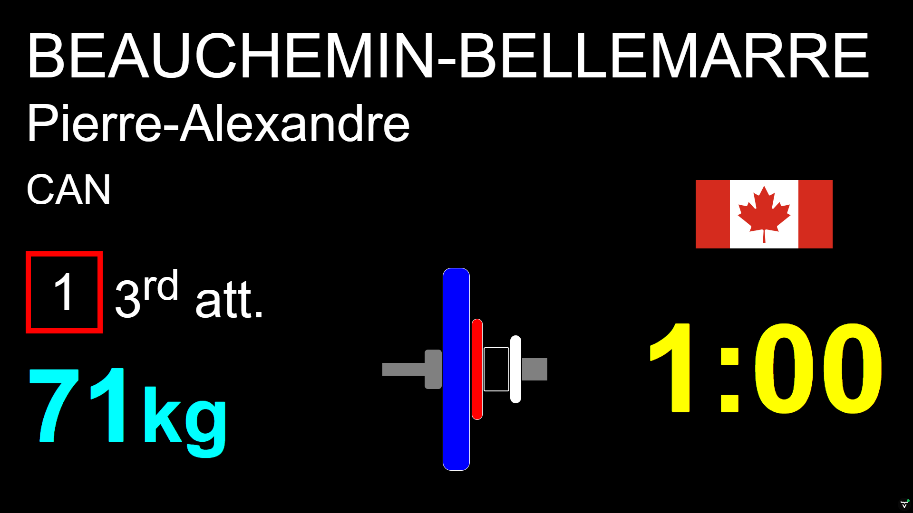

Warning:  This feature is new and may evolve.  It has been implemented in the simplest way to validate its usefulness. 

> NOTES
>
> - When adding flags and pictures for the first time, you must restart the program (it checks on startup whether flags or pictures are present)
> - As it stands, the picture feature requires running locally and not in the cloud.  You may use flags, however.

### Including a Flag

The current implementation is very simple and is meant for inter-provincial or international meets where the team name matches the flag. 

- Flags are expected to be in `.svg` or `.png` format.  
- In the above example, the team name for the athlete is CAN and the flag is expected to be found in the `local/flags/CAN.svg` file.  *The spelling of the file name must be identical to the team name (spaces, lower and upper case, accented characters, etc.)*.
- If the flag is not found, the space will be left empty
- This feature can be used in the cloud, but pay attention to the file sizes.  Smaller is better.

### Finding Flags

The easiest place to find flags is Wikipedia.

1. Go to the [List of ISO 3166 country codes](https://en.wikipedia.org/w/index.php?title=List_of_ISO_3166_country_codes&oldid=1119572367)
2. Find the country you want and click on the link
3. On the right-hand side of each country is a picture of the flag. CLICK on the flag to display it in full size.
4. At the bottom right of the window there is a download link to retrieve the SVG file.
5. Rename the flag whatever name you are using for the team.  For an official IWF competition the codes are found [here](https://iwf.sport/focus-on-iwf/federations/) example, `CAN.svg` would be the name for Canada. 

Another source, where all the flags are in the same size (4:3 ratio) is [flag-icons/flags/4x3 at main · lipis/flag-icons (github.com)](https://github.com/lipis/flag-icons/tree/main/flags/4x3)

1. Go to the [List of ISO 3166 country codes](https://en.wikipedia.org/w/index.php?title=List_of_ISO_3166_country_codes&oldid=1119572367)
2. Locate the two-letter code for the country you want
3. Find the file in [flag-icons/flags/4x3 at main · lipis/flag-icons (github.com)](https://github.com/lipis/flag-icons/tree/main/flags/4x3) and click to download it.
4. Rename the flag to be the name of the team with the exact spelling.  So `ca.svg` becomes `CAN.svg`

### Including a Picture of the Athlete

The current implementation is very simple.

- Athlete pictures are expected to be in JPEG format.  They can be stored under the `.jpg` (preferred) or `.jpeg` extension.

- Due to the presence of the picture, the font size for the last name is slightly smaller and the flag is moved to the center section.

- The picture should be edited and saved to a small size (100KB).  Pictures are saved in the `local/pictures` folder (see below for the conventions)

  > Because of the size of the pictures you should NOT use pictures when running in the cloud.  Under the current very simple implementation you will run out of memory.

- The picture should be named using the *Membership* number of the athlete.  This will allow you to create a folder with all the pictures of the athletes in a federation and reuse it.

  - If running a multi-federation event, you can use the membership field to assign a competition-specific registration number.
  - In the above example, the athlete's registration number is 4123.  The picture must be stored in the `local/pictures/4123.jpg` file.

- There is no need to have a flag in order to have a picture.  The two features are independent.