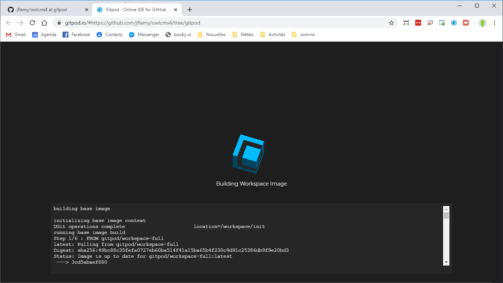
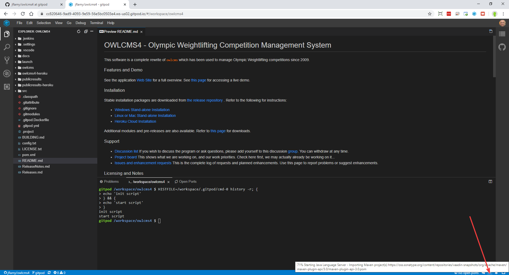
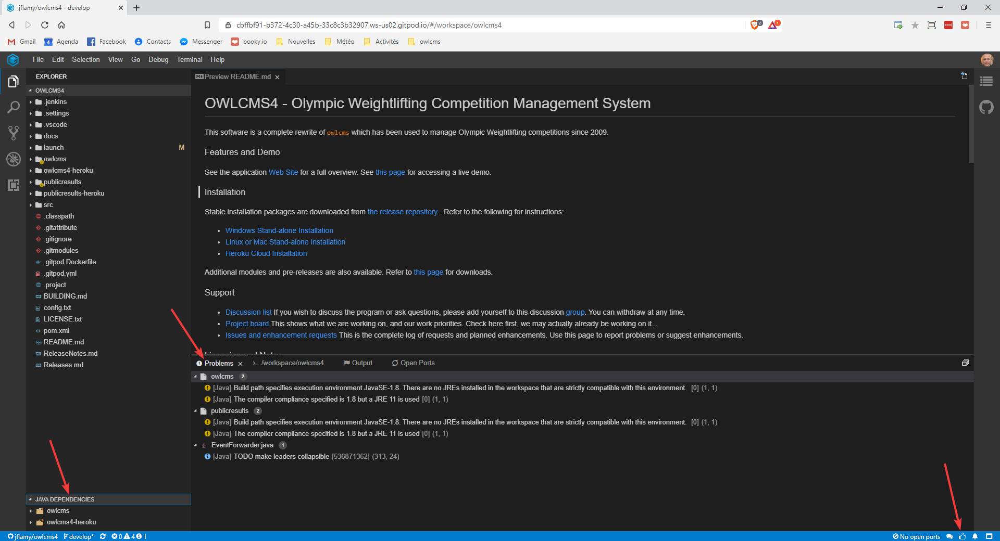
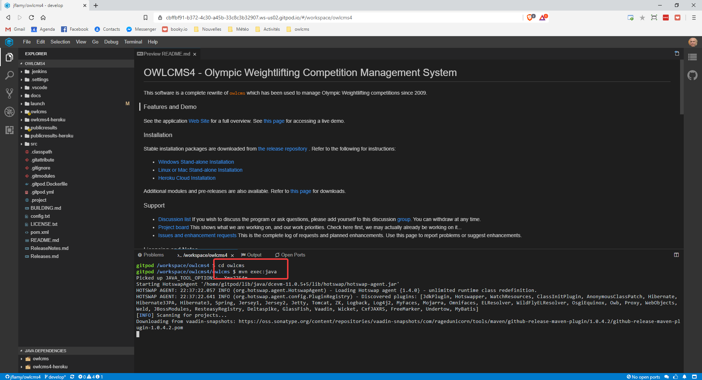
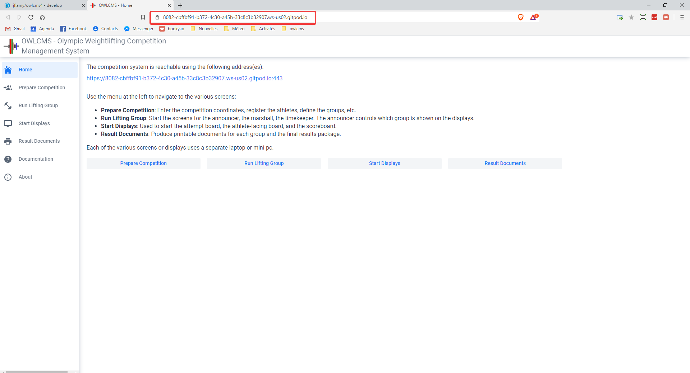

OWLCMS is a Java and JavaScript-based project that follows the modern open-source practices.  It relies on Maven and Git for its build and version control.

A complete, fully-functional copy of a development environment can be obtained in the cloud in a matter of minutes using a service called [Gitpod.io](https://www.gitpod.io).  For our purposes, the service is free. Gitpod provides a fully configured environment based on Visual Studio Code and Eclipse and checks out the source from the OWLCMS repository.  Contributors can then create `pull requests` so that their changes are merged with the official release.

Developers more at ease with the desktop versions of Eclipse or VS Code can obviously use these tools instead. The github repository contains the settings files that should work with both these environments with minimal adjustments.  Should anyone provide settings files for other tools like IntelliJ IDEA we would integrate them, of course.

#### Create the GitPod workspace

Click on the following link https://gitpod.io#https://github.com/jflamy/owlcms4/tree/develop 

What this link does is tell gitpod to open the `develop` branch of the owlcms4 source directory.  Gitpod notices that there is a Docker instruction file inside, and proceeds to create a workspace according to these instructions.  The first time around, this may take a couple minutes, because gitpod fetches Java installation files and other things.

#### Initial Load of Dependencies

The owlcms4 program relies on several open source Java modules which in turn rely on several others. The workspace needs to fetch all these libraries one by one.  You will notice at the bottom right a spinning circle icon. Moving the cursor on top shows what is being fetched.  This fetch occurs only once, but may take up to five minutes.

#### Ready for work

Once the spinner goes away, it is replaced by a "thumbs up" icon.  The Java Dependencies section appears at the bottom left, and if you click on the `Problems` tab, there will be messages

#### Starting the application

The workspace contains owlcms and all its siblings such as the public results relay, the cloud updater, and the installer.  To get started it is necessary to go to the owlcms directory.

1. go to the owlcms directory `cd owlcms`
2. Start the application by typing `mvn exec:java`  (`mvn` is short for "Maven", the program that keeps track of all the libraries required and of all the rules for building the package).  
3. The first time around, the program will notice that the JavaScript files it relies on are not present.  A second round of "go fetch files" takes place, for a couple minutes.

#### Using the application

After the fetch is done, you will be prompted to let gitpod open a browser window.  This window will be automatically connected to the running program.

#### Seeing the effects of changes

From that point, you can change the Java or JavaScript files.  As soon as they are saved, the Java and JavaScript compilers are configured to recompile them and reload them.  So you can just reload your browser and check.

Some changes, however, are too complex to handle live.  In these cases, you need to kill the mvn process by using Control-C, and relaunch a new `mvn exec:java`

The main locations of interest are as follows

- `src/main/java/app/owlcms/ui` contains the code for the technical officials screens.  This code is written in Java using the Vaadin framework.  See this [introduction](https://vaadin.com/docs/v14/flow/introduction/introduction-overview.html)
- `frontend/components` contains the JavaScript code for the various displays (the black screens).  Each component is coded as a Web Component.  Web Components are JavaScript files that follow a standard understood by all the modern browsers which allows them to display seamlessly.  The Web Components in owlcms are currently written using the [Polymer library from Google](https://polymer-library.polymer-project.org/3.0/docs/devguide/feature-overview). 
- Each of the displays has a corresponding Java file in `src/main/java/displays` that provides it with the data it needs.  There are no REST interfaces, the Vaadin framework does this for us, and most importantly, allows the server to push the information to the clients as it is available without us having to do anything.

