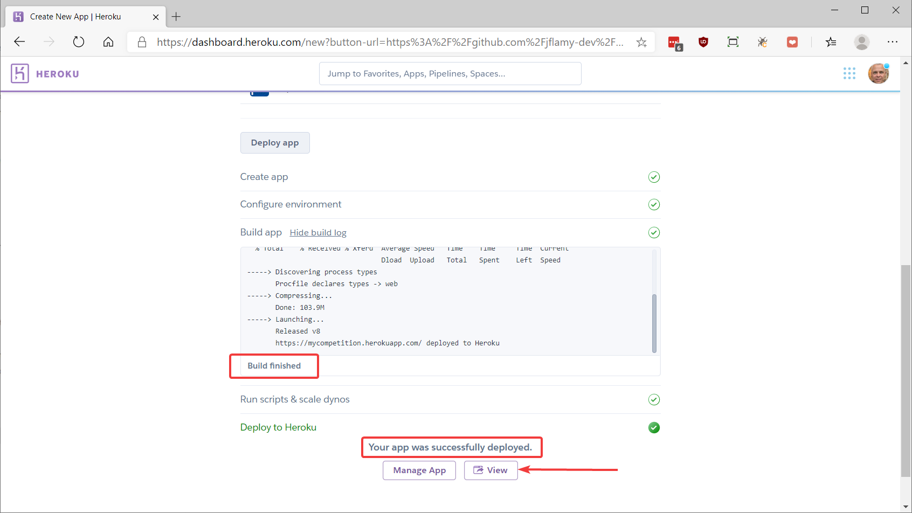
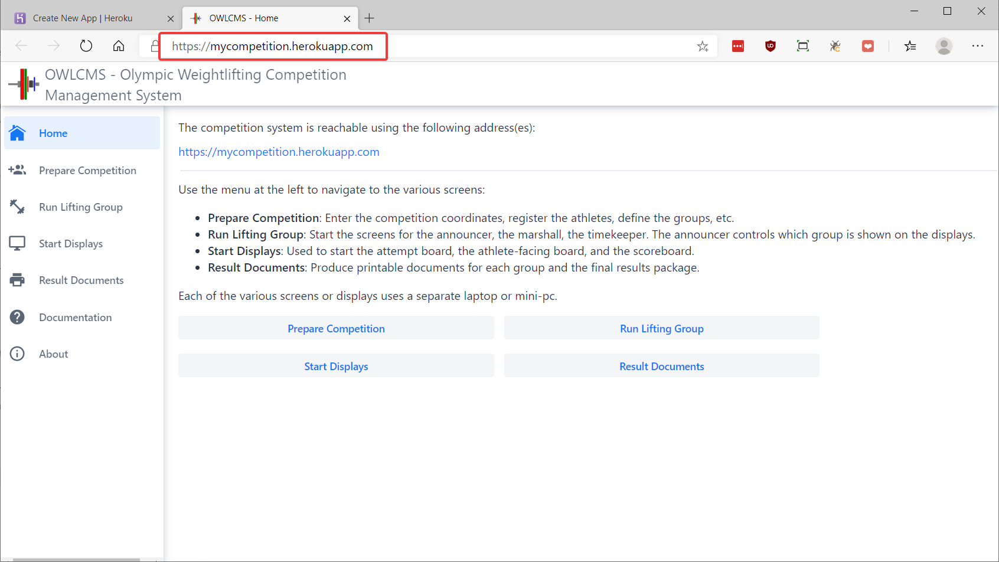

# Deploy OWLCMS on Heroku

Heroku is a cloud service provider that provides an attractive pricing plan for running programs like OWLCMS.  The installation process for Heroku is extremely simple and there is nothing whatsoever that needs to be installed on any of the laptops other than a browser.  

There used to be a completely free plan, but this was discontinued in 2022. Because Heroku bills by the second, you can actually turn off your site when you don't use it.  By doing so the costs for preparing, running a competition and gathering the results is roughly 0.50 US$ per day.

For larger competitions, you can run a meet for less than 10$ per day, see the [large competition instructions](HerokuLarge).

**1. Create a free Heroku Account**

- Go to page https://heroku.com
- Create an account. Remember the login and password information.

**2. Start the deployment process**

Click on this purple button to start installation of owlcms on Heroku cloud.

**3. Name your application and deploy**

Enter the name that will be used by the officials.  Once you are done start the deployment (this will prepare the application and make it available)

**4. Check correct deployment**

**5. Go to the application**

**6. Time zone configuration**

Heroku data centers run on universal time by default (UTC).  So the times appearing in the intermission timers will be wrong, for instance.  You will therefore need to [set the competition time zone](Preparation#time-zone) according to the published schedule when  entering the competition information.

## Check for updates

Once you have created the application once, you can download a program that will check for updates and remote control Heroku to grab them.   See [Instructions](https://github.com/owlcms/owlcms-heroku-updater) and [Releases · owlcms/owlcms4-heroku-updater (github.com)](https://github.com/owlcms/owlcms4-heroku-updater/releases)

## Control access to the application

In a gym setting, people can read the web addresses on the screens, and one day, some "funny" person will log in to the system and be tempted to mess things up.
- We suggest that you set a PIN or Password that officials will be required to type when first logging in.  This is done on via the `Prepare Competition` page, using the `Language and System Settings` button.

- If running from a competition site, you can restrict access to the cloud application to come only from your competition site router. The access list is a comma-separated list of allowed IPv4 addresses.   In order to find the proper value:

  - From your competition site, browse to https://google.com and 
  
  - Type the string  `my ip`  in the search box.  
    This will display the address of your competition site router as seen from the cloud.  
    
  - You should see a set of four numbers separated by dots like `24.157.203.247`  . This the address you should use -- owlcms will reject connections coming from other places than your competition router. 
  
  Note that if you use the OWLCMS_IP or -Dip settings, these will take precedence over what is in the database.
  
- If you have set a password, you may need to set the OWLCMS_BACKDOOR variable to avoid entering passwords on the screens used for video broadcasting.

## Configuration Parameters

See the [Configuration Parameters](./Configuration.md ':include') page to see additional configuration options in addition to the ones presented on this page.
