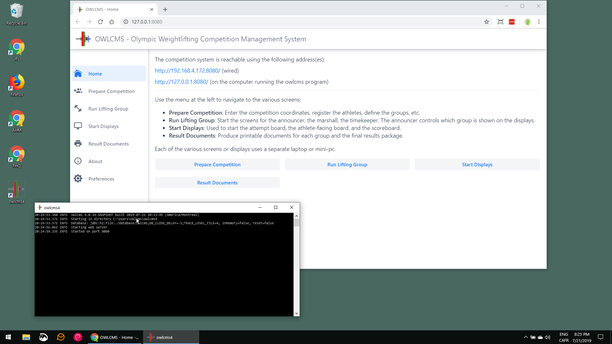

Heroku is a cloud service provider that provides an attractive free platform for running programs like owlcms.  When running on Heroku you only need a good Internet connection, and do not need to configure a master laptop.

Every screen or display will be through a browser that connects to the application running in the cloud.
You will need one laptop or minipc for each display.

## Setup an Heroku account

- Go to page https://heroku.com

- Create a free account. Remember the login and password information.

- Create an app -- this is the name under which your cloud copy of owlcms will be known. Pick an available name, typically the name of your club or federation.

  

  

- On the application configuration page, click on the `Configure Add-ons` link and choose the Postgres plugin. 

  

  

- Select the free database plan; the Provision button will connect a database to your application.

- Add a second add-on called `PaperTrail` using the `Find more add-ons` button.  This will allow you to see the logs for the application and download them.  Use the free plan.

  

- Click on `Papertrail`. In order to see the application logs, go to the bottom of the page and click on the Saved searches bullet list icon. You will be using the `Web app output` entry.

  

## Installing the deployment tools

The following steps will allow you to download the owlcms application and update it on the cloud.

-  Go to page https://devcenter.heroku.com/articles/heroku-cli#download-and-install

- For Windows 
  
  - Get the Windows installer.  Ignore the note about installing Git, we don't need actually need it.
  - Run the installer to install the Heroku CLI (command line interface)
  - Click on the Windows icon at the bottom left and type cmd
  
- For MacOS and Linux, follow the instructions on the link and start a terminal shell
  
- Run the following commands
  
```bash
  heroku login
  heroku plugins:install java 
```
  These commands are only needed once.

## Deploying a version of owlcms to Heroku

- Get the current installation file ending in `.zip` from the <https://github.com/jflamy/owlcms4/releases> page (see the "Assets" section)
  
  
  
- Download a release and unzip it release to a directory by double-clicking on it.   
  
- Start a command shell and go to the directory where you unzipped the files.
  ```bash
   cd *the_directory_where_you_unzipped_the_files*
  ```

- Run the deploy command (replace X.Y and myHerokuAppName with the proper values)

  ```bash
   heroku deploy:jar owlcms-4.X.Y.jar --app myHerokuAppName  
  ```
  
- Open the application using the following command (or go to ``https://myfederation.herokuapp.com``). This will start the application. Heroku provides the database names and database login information automatically.  See below for securing the application for actual competition usage.
  
  ```bash
  heroku open --app myHerokuAppName 
  ```
  
- If you want to run in demo mode with fictitious athletes, run the following commands before doing the deployment. This adds the `-DdemoMode=true` flag to tell owlcms to reset on every start and recreate the fake data.
  
  ```bash
  cp Procfile prodProcfile
  cp demoProcfile Procfile
  heroku deploy:jar owlcms-4.X.Y.jar --app myHerokuAppName
  ```

- If after running a demo you want to restore competition mode
  
  ```bash
  cp prodProcfile Procfile
  heroku deploy:jar owlcms-4.X.Y.jar --app myHerokuAppName
  ```
  

Reference: https://devcenter.heroku.com/articles/deploying-executable-jar-files

## Controlling access to the application

In actual competition settings, malicious users may know the password to your WiFi.  In cloud settings, the application address will be visible to attendees on some screens.  It is therefore recommended to limit access to the application.  This is done by setting two environment variables:

- `IP` is a comma-separated list of allowed addresses.  It is used when connecting to the cloud from a router on the competition site. In order to find the proper value, go to https://google.com and type 
  `my ip`
  in the search box.  This will display the address of your competition site router as seen from the cloud.  You should see a set of four numbers separated by dots like `24.157.203.247`                                        

- `PIN` is an arbitrary strings of characters that will be requested when starting the first screen whenever you start a new session (typically, once per browser, or when the system is restarted).  You can use it whether or not you are connected to the cloud.

### Securing a Heroku cloud installation

The simplest way is to use the Heroku dashboard for the application and add the IP and PIN variables under the Settings tab, in the Config Vars section.


## Initial Cloud Startup

You have two options to start your Heroku cloud application.

1. Use the Heroku CLI, and type the following (replacing of course`myHerokuApp` with the name of your own application)

   ```
   heroku open --app=myHerokuApp
   ```

2. Open a browser with the address `https://myHerokuApp.herokuapp.com` (replacing of course`myHerokuApp` with the name of your own application) name



- The command-line window (typically with a black background) is the OWLCMS4 master web server.  All the other displays and screens will connect to this server.  You can stop the program by clicking on the x, but if you do so, every single screen and display will spin in wait mode until you restart the program.

- The white window is a normal browser.  If you look at the top, you will see two or more lines that tell you how to open more browsers:

  

  In this example the other laptops on the network would use the address `http://192.168.4.1:8080/` to communicate with the master server.  

  The address <u>depends on your own specific networking setup</u> and you must use one of the addresses displayed **on your setup.**  If none of the addresses listed work, you will need to refer to the persons that set up the networking at your site and on your laptop.  A "proxy" or a "firewall", or some other technical configuration may be blocking access, or requiring a different address that the server can't discover.