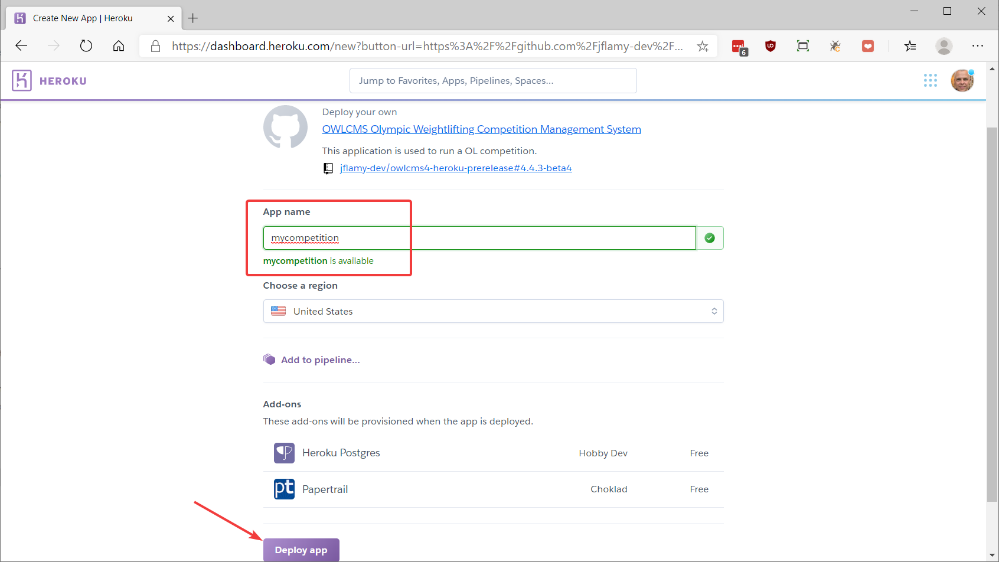
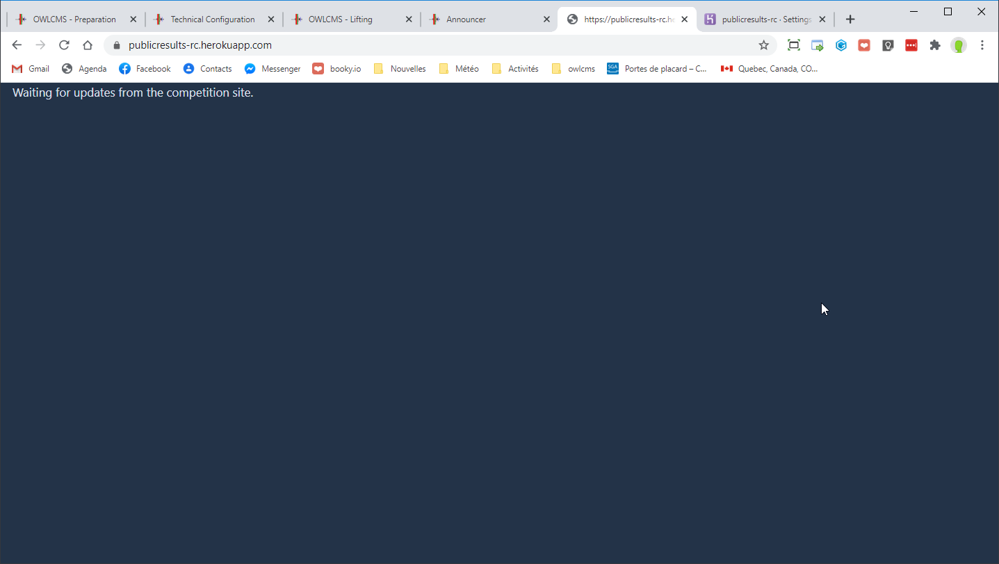

# Deploy OWLCMS on Heroku

Heroku is a cloud service provider that provides an attractive pricing plan for running programs like OWLCMS.  The installation process for Heroku is extremely simple and there is nothing whatsoever that needs to be installed on any of the laptops other than a browser.  

There used to be a completely free plan, but this was discontinued in 2022. Because Heroku bills by the second, you can actually turn off your site when you don't use it.  By doing so the costs for preparing, running a competition and gathering the results is roughly 0.50 US$ per day.  You can then stop billing (see the [Stopping and Resuming Billing](#stopping-and-resuming-billing) section below)

For larger competitions, you can run a very large meet for less than 10$ per day, see the [large competition instructions](HerokuLarge).  The instructions explain how to go back to the more economical setting afterwards  (or you can stop billing)

### Preparation Step

**1. Create a Heroku Account**

- Go to page https://heroku.com
- Create an account. Remember the login and password information.

### Install owlcms

**1. Start the deployment process**

Click on this purple button to start installation of owlcms on Heroku cloud.

[](https://heroku.com/deploy?template=https://github.com/jflamy-dev/owlcms-heroku-prerelease)

**2. Name your application and deploy**

Enter the name that will be used by the officials.  Once you are done start the deployment (this will prepare the application and make it available)



**3. Check correct deployment**


**4. Go to the application**


**5. Time zone configuration**

Heroku data centers run on universal time by default (UTC).  So the times appearing in the intermission timers will be wrong, for instance.  You will therefore need to [set the competition time zone](Preparation#time-zone) according to the published schedule when  entering the competition information.

### Control access to the application

In a gym setting, people can read the web addresses on the screens, and one day, some "funny" person will log in to the system and be tempted to mess things up.
- We suggest that you set a PIN or Password that officials will be required to type when first logging in.  This is done on via the `Prepare Competition` page, using the `Language and System Settings` button.


- If running from a competition site, you can restrict access to the cloud application to come only from your competition site router. The access list is a comma-separated list of allowed IPv4 addresses.   In order to find the proper value:

  - From your competition site, browse to https://google.com and 
  
  - Type the string  `my ip`  in the search box.  
    This will display the address of your competition site router as seen from the cloud.  
    
  - You should see a set of four numbers separated by dots like `24.157.203.247`  . This the address you should use -- owlcms will reject connections coming from other places than your competition router. 
  
  Note that if you use the OWLCMS_IP or -Dip settings, these will take precedence over what is in the database.
  
- If you have set a password, you may need to set the OWLCMS_BACKDOOR variable to avoid entering passwords on the screens used for video broadcasting.

### Install the Public Results Scoreboard (optional)

The public results scoreboard is an optional module.  It allows people with internet access to follow the competition scoreboard.  This can be the coaches using in a tablet in the warmup room, people in the audience, or people watching a live stream of the competition.

See [this page](PublicResults) for details.

The process is the same as for the owlcms application

1. Click on the purple button below to start the installation of the public scoreboard on Heroku Cloud.

   [](https://heroku.com/deploy?template=https://github.com/jflamy-dev/publicresults-heroku-prerelease)

2. Enter your Heroku account (or create one if you haven't)

3. Enter a meaningful application name.  In the following example, we use `owlcms-test-publicresults` We will later use `owlcms-test-publicresults.herokuapp.com`  to see the results.  You should use a name that makes sense to your club or federation.

   *(Reminder: You can click on the images to make them bigger)*

   

4. Deploy the application. This will fetch the application, install it, and make it available to the public.
   

5. You can check that the application is running by starting a new browser tab. In our example, we connect to `https://owlcms-test-publicresults.herokuapp.com`.  Since we have not yet connected owlcms to feed publicresults, you will see this screen.
   

6. We now need to configure a secret code to keep communications secure between the competition site and the publicresults repeater.  Go to the `Settings` page for the application.
   
7. Create configuration variable `OWLCMS_UPDATEKEY` and set it to the secret key that will be shared with owlcms.  **Use something easy to type, but quite long**, and not easily guessed.  The  password to your Heroku account and the update key is what prevents vandals from messing up your scoreboards.  Do not share them, and make sure they cannot be guessed easily.
   
8. Copy the value for the update key (Ctrl-C)

9. Restart the publicresults application
   

10. Start a new browser tab and go to the address for the application (or you can use the `Open app` button at the top right) and check that the application is again waiting.
    

11. You now need to connect the two applications together, so that publicresults receives updates from owlcms.  See [this page](PublicResults) for instructions.

### Stopping and Resuming Billing

> The easiest way to stop billing is to actually to delete the application from the Heroku page.   This is not as bad as it seems, because the installation process is very quick. This also ensures that you have the latest version the next time around.

In order to stop billing *without* uninstalling the application, you need to install a command interface from [this page](https://devcenter.heroku.com/articles/heroku-cli). NOTE: you can IGNORE the prerequisite about `git`. It is NOT needed for our purpose.

- First, start a command line window and type

  ```
  heroku login
  ```

- In order to stop billing on your application "myclub" (use your own name).  The same apply for myclub-results

  ```
  heroku scale web:0 -a myclub
  ```

  Repeat with any other app you may have (for example, if you have installed publicresults)

- In order to restart the application

  ```
  heroku scale web:1 -a myowlcms
  ```

### Scaling Up or Down

In order to run a very large competition (say over 100 athletes), you may want to allocate more memory and use a larger CPU.  You can run a very large meet for less than 10$ per day, by changing the settings as explained in [large competition instructions](HerokuLarge).  The instructions explain how to go back to the more economical setting afterwards  (or you can stop billing)