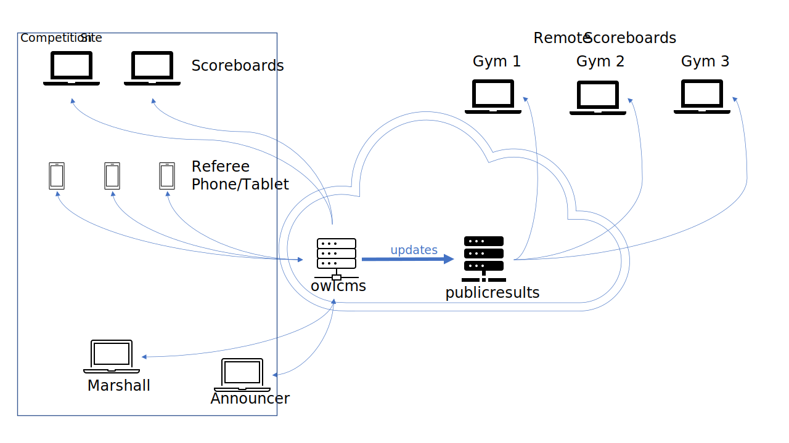

Several installation options are possible, depending on what is available at the competition site and the size of the competition.

## Easiest: Cloud-Based Installation (Internet required)

If there is good internet communication at the competition site, there is no need to install anything locally. 

- There is a one-click install procedure to a free (0$) cloud service called Heroku (a division of Salesforce.com).  For large competitions, there are moderately priced alternative (20$ or less), discussed below.
- The install will create your own private copy of the application, with your own database.
- The owlcms software runs as a web site. All the various display screens and devices connect to the cloud using the competition site's wifi or ethernet network.

See the following for instructions

  * [Heroku Cloud Installation Instructions](Heroku)

## Stand-alone: Laptop installation

If there is no Internet connectivity at your competition site, or if you can't trust it, you can use a stand-alone setup and run the software on a laptop.

- The software runs on a laptop (labeled owlcms in the diagram). 

- All the other screens and officials connect to that laptop using only a web browser, so you can use whatever you want (old laptops, chromebooks, tablets, firetv sticks, etc.).  All the communications take place over a local network (wifi or ethernet).

- You can run owlcms on the same machine as one of the officials.  It is often the case that owlcms runs on the same machine as the announcer or the competition secretary.  In the simplest setups, there is just the announcer, and maybe one scoreboard.

- You can referee using hand signals, flags, phones, or dedicated devices. See [this page](Refereeing)

  

See the following instructions

  * [Windows Stand-alone Installation](LocalWindowsSetup)
  * [Linux or Mac Stand-alone Installation](LocalLinuxMacSetup)

## Virtual or Distanced Competitions

There are additional modules available to support more involved scenarios.  For example, it is possible to have individual scoreboards available to every coach -- supporting physical distancing.  This can also be used to provide individual scoreboards to every member of the public watching the competition remotely.

A competition with a main site and remote gyms connected by videoconferencing could look as follows

Besides the three options discussed below, you may want to read the following

*	[Distancing using Individual Scoreboards](Distancing)
*	[Virtual Competitions and Remote Referees](Virtual)
*	[Virtual Competitions: Running and Streaming](ZoomOBS)

### Option 1: Heroku Cloud Hosting

This option is the most likely to be used, as even large competitions can be handled cost-effectively.  

In order to host a virtual competition effectively, you need to install both owlcms and publicresults.

*	Free Heroku hosting, for single-day Club or Regional meets (60 lifters or less as a rule of thumb, due to the limits on the free configuration)
  *	Install owlcms, as described on [this page](Heroku).
  *	Install publicresults, and connect the two applications together, as explained on [this page](Remote)
*	[Large Competition Heroku Hosting](HerokuLarge) (for multi-day competitions or large virtual competitions).  The price for a week-end competition is around 20 US$

### Option 2: Cloud Kubernetes Hosting

If you wish to control the full setup, then you can setup your own cloud-based environment.

Even though the following uses a paid setup, you can still run a competition for less than 10 US$. You also get the added benefit that if your run a larger competition, you can increase the memory available. 

*	[Kubernetes on Digital Ocean Cloud](DigitalOcean)

### Option 3: Home Kubernetes Hosting with Cloud Access

For the technology enthusiast, if you have good internet connectivity at home, and a good performance Windows, Linux or Mac machine, you can use the following approach

*	[Home Hosting with Secure Internet Access](k3d)

If you have a dedicated Linux Host at home, you can also combine options 2 and 3.  You would use the same instructions as Option 2 to setup a machine with k3s, and then use KubeSail as an outside proxy as in Option 3.