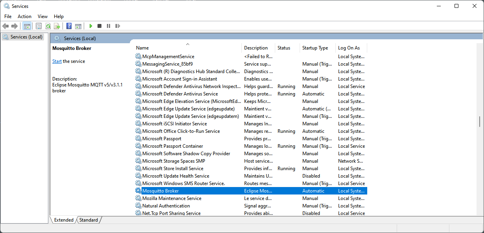
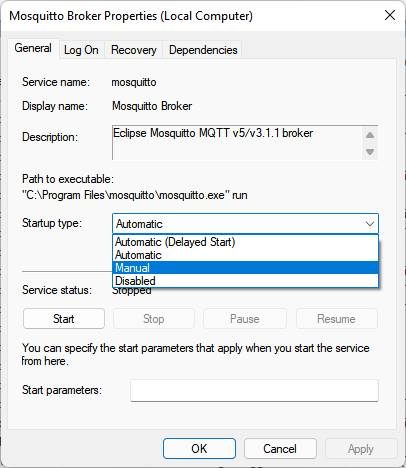

## MQTT Configuration for Refereeing Devices

https://github.com/jflamy/owlcms-esp32 contains Arduino code and simple circuit schematics to build a simple refereeing device with an indicator LED and a buzzer to remind a referee to enter a decision.

The devices and owlcms use the MQTT protocol to communicate with each other.  The communication goes through an MQTT server that can be installed on the local area network or in the cloud.  MQTT is very lightweight and is used in home automation, in industrial telemetry application and other "Internet of Things" (IoT) settings.

### Local Installation of the MQTT server and tools

1. Install a local MQTT server.  We suggest [Mosquitto](https://mosquitto.org/download/).  You can install it on the same machine as your owlcms if running locally. The installer works silently and creates a background service.

2. For initial testing purposes, we will not be running Mosquitto as a service.  We will start it manually.

   1. Click on the Windows icon and type "Services"
   2. Scroll down in the list to find Mosquitto
   3. Right-click and select the Manual startup mode.

   

3. Go to the Installation directory for Mosquitto (normally, under `C:\Program Files\Mosquitto`).

4. Open the  `mosquitto.conf`  file.  Add the following lines at the top.  The `allow_anonymous` line is used for initial testing. For actual production, a password file should be added (see [Passwords](#Passwords))

   ```shell
   # owlcms config parameters  for mosquitto
   listener 1883
   allow_anonymous true
   connection_messages true
   log_type all
   log_timestamp true
   log_timestamp_format %Y-%m-%dT%H:%M:%S
   ```

5. Start a `cmd` command-line window and 

   ```
   cd  C:\Program Files\Mosquitto
   .\mosquito.exe -v -c mosquitto.conf
   ```

   You should now see all the traffic going through the server

6. Install a MQTT interactive tool for testing and monitoring.  An easy tool that runs as a Chrome application is [MQTTlens](https://chrome.google.com/webstore/detail/mqttlens/hemojaaeigabkbcookmlgmdigohjobjm?utm_source=chrome-app-launcher-info-dialog) . 

### Local configuration of owlcms

owlcms needs to connect to your MQTT server.  

1. Go to the installation directory, and locate the `owlcms.l4j.ini` file (depending on your Windows configuration, the `.ini`can be hidden).  
2. For our server without any passwords, add the following lines at the beginning of the file. Obviously, replace `192.168.0.101` with the actual IP address or name of your server (same as reported by owlcms when it starts up.)

```
-DmqttServer=192.168.0.101
-DmqttUserName=""
-DmqttPassword=""
-DmqttPort=1883
```

> For actual production, we will add a password file (see [Passwords](#Passwords))

### Local Testing

In MQTT, all communications go through an intermediate server (often called the broker).  By subscribing to all the owlcms topics, we can effectively monitor everything that is going on.  Conversely, we can also simulate all the messages sent to the broker by the devices or by owlcms.

1. Start MQTTLens.

2. Create a connection to your local Mosquitto  and Save.
   

3. If you look at the mosquitto window, you should see something like

   ```
   2022-02-02T14:09:03: New client connected from 192.168.1.101:39899 as lens_QHQNpt4hPp5h5RWQBnRHBsmLXEX (p1, c1, k120, u'owlcms').
   ```

4. Create a Subscription to `owlcms/#` 
   This will show all the messages received that start with owlcms, no matter their depth) 
   Click "Subscribe"

5. Mosquitto will show something like

   ```
   2022-02-02T14:09:03: Received SUBSCRIBE from lens_QHQNpt4hPp5h5RWQBnRHBsmLXEX
   2022-02-02T14:09:03:    owlcms/# (QoS 0)
   ```

6. Start owlcms.  When owlcms starts, it sends a message to turn on the LED on and off. So in the Subscription section of the application, you should see something like this for each of your platforms (`A` will be replaced by the actual name of your platform(s))

7. Mosquitto shows the message received from owlcms ("received publish") and the send to Lens ("sending publish").  "paho" is the name of the library used by owlcms.

   ```
   2022-02-02T14:15:55: Received PUBLISH from paho100726418685300 (d0, q1, r0, m1, 'owlcms/led/A', ... (2 bytes))
   2022-02-02T14:15:55: Sending PUBLISH to lens_QHQNpt4hPp5h5RWQBnRHBsmLXEX (d0, q0, r0, m0, 'owlcms/led/A', ... (2 bytes))
   ```

8. We can also simulate what the referee will send to Mosquitto. 
   For platform `A`, referee 1 will send its decisions on topic `owlcms/decision/A` . 
   The message is the referee number followed by a space and then `good` or `bad`

   

9. Mosquitto will display the results.  Notice that all the subscribers get the message, including lens itself.

```
2022-02-02T14:23:40: Received PUBLISH from lens_QHQNpt4hPp5h5RWQBnRHBsmLXEX (d0, q0, r0, m0, 'owlcms/decision/A', ... (6 bytes))
2022-02-02T14:23:40: Sending PUBLISH to paho100726418685300 (d0, q0, r0, m0, 'owlcms/decision/A', ... (6 bytes))
2022-02-02T14:23:40: Sending PUBLISH to lens_QHQNpt4hPp5h5RWQBnRHBsmLXEX (d0, q0, r0, m0, 'owlcms/decision/A', ... (6 bytes))
```

10. You can send a second message `2 good`. After the second decision, owlcms will send two messages to `owlcms/decisionRequest/A/3` indicating that referee 3. There will be an `on` message, and two seconds later, an `off` message.  The device will use this to remind the referee, and after two seconds,  owlcms tells the device to end the reminder.  The device can either do its own timing (and ignore the end message), or wait for the owlcms message.
11. Once everything works, you can choose to let Windows run Mosquitto in the background
    - You can issue the commands `net start mosquitto` and `net stop mosquitto` to start and stop the MQTT server.
    - You can set Mosquitto to start automatically on reboot by using the Services program to set the starting mode to `Automatic`.

### Cloud configuration and testing

The process is the same.  The one difference is that you will be using a cloud MQTT server.

You want a cloud server that requires a login and a password.  We suggest StackHero because it has a free test mode.

1. Create a Heroku account (you probably have one already if you are using the cloud version)
2. Create a new application to be used for MQTT.  Give it a meaningful name, because you will only need to keep it - you can have only one free MQTT server (you will not be creating a new one for each competition)
3. Add the StackHero Mosquitto add-on to your new application (under Resources).  Select the `Test` plan which is free.
4. Click on the link to configure a username and password
5. Follow the same instructions as above, using the hostname, username and password from the configuration page.

### Passwords

Once initial testing is done, you should add passwords to the configuration.

1. Start a `cmd` window (click on the start menu icon and type `cmd` to locate it, or use the Windows-R keyboard shortcut).

2. Go to your home directory (or any directory that DOES NOT INCLUDE A SPACE).  Create a `mosquitto` subdirectory.

   ```
   cd %HOMEPATH%
   mkdir mosquitto
   cd mosquitto
   ```

3. The following *creates* (`-c`) a new password file, with a user `owlcms` (you can use whatever username you want).
   You will be prompted to enter a password (twice).  
   The file contains an undecipherable encoding of the password.  If you just want to change the password, or need to add another user, call mosquitto_passwd but *without* the `-c` (otherwise you will erase and recreate a new file.)

   ```
   "C:\Program Files\mosquitto\mosquitto_passwd.exe" -c pwfile owlcms
   ```

4. Change the beginning of the mosquitto.conf file to look like the following.  Use the correct full path for the password file. The name must not have any blanks, and you cannot use quotes.

   ```
   listener 1883
   allow_anonymous false
   password_file C:\users\jf\mosquitto\pwfile
   connection_messages true
   log_type all
   log_timestamp true
   log_timestamp_format %Y-%m-%dT%H:%M:%S
   ```

5. Change the owlcms configuration to use the username and password

## MQTT message sequence

The current sequence of message is as follows (subject to change based on real use and feedback)

1. owlcms startup. owlcms publishes the following (the topic is shown first, followed by the message). There is a one second interval between the two messages.

   ```
   owlcms/led/A on
   owlcms/led/A off
   ```

2. Referee decisions. The first two referees will send their decision  (1 and 3 in the example, `good` or `bad`)
   If the timer is not started, the decisions will be ignored by owlcms (but a notice will be given to the announcer)

   ```
   owlcms/decision/A 1 good
   owlcms/decision/A 3 good
   ```

3. owlcms sends a reminder as soon as the 2 decisions have been entered.  The refereeing device can choose to wait a few seconds before starting its feedback.  

   ```
   owlcms/decisionRequest/A/2 on
   ```

   owlcms sends a stop 2 seconds later. The `off` message is NOT a confirmation that a decision has been received, it is just a convenience for device programmers that don't want to implement a timer.  A device that manages its own timers can ignore.

   ```
   owlcms/decisionRequest/A/2 off
   ```

4. The third referee sends the decision

   ```
   owlcms/decision/A 1 bad
   ```

5. The jury summons a referee (three messages, one per referee if all three are summoned).  The `off` message is a convenience for device programmers that don't want to implement their own timer.

   ```
   owlcms/summon/A/1 on
   owlcms/summon/A/1 off
   ```

   