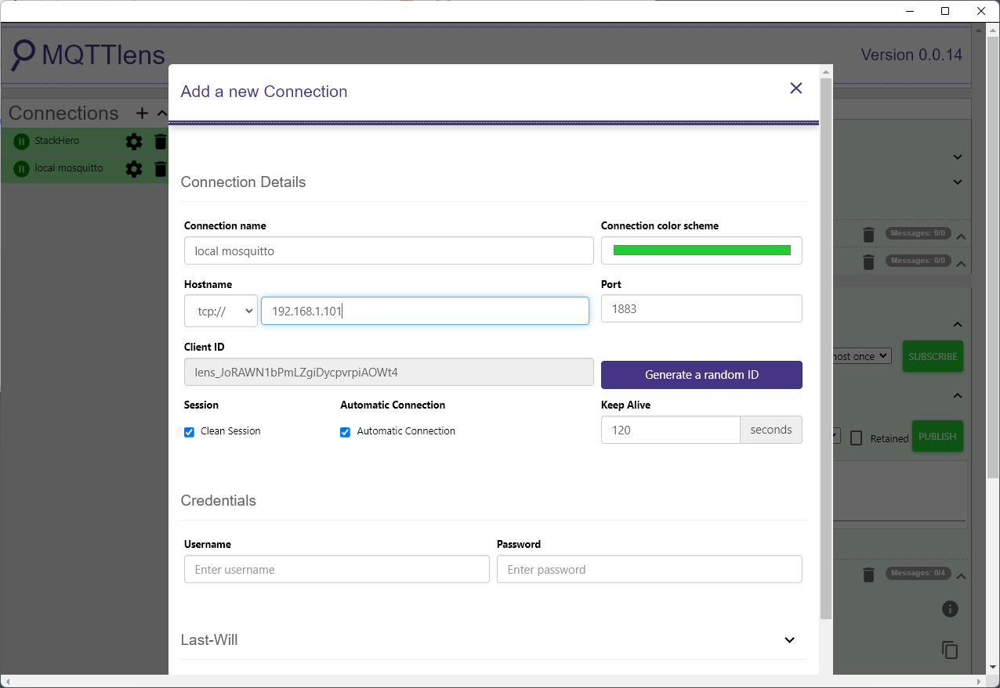
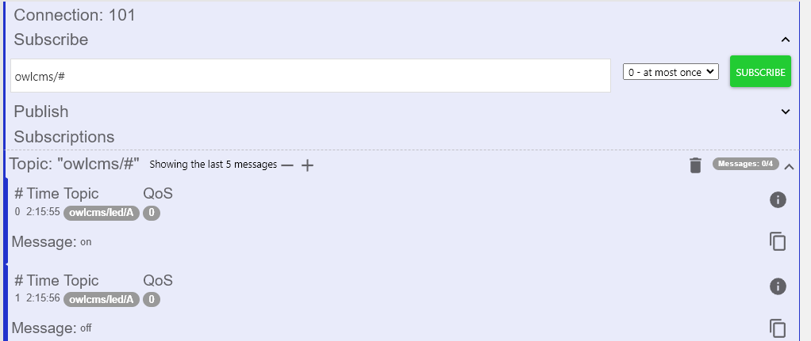

## MQTT Configuration for Refereeing Devices

https://github.com/jflamy/owlcms-esp32 contains Arduino code and simple circuit schematics to build a simple refereeing device with an indicator LED and a buzzer to remind a referee to enter a decision.

The devices and owlcms use the MQTT protocol to communicate with each other.  The communication goes through an MQTT server that can be installed on the local area network or in the cloud.  MQTT is very lightweight and is used in home automation, in industrial telemetry application and other "Internet of Things" (IoT) settings.

### Local Installation of the MQTT server and tools

1. Install a local MQTT server.  We suggest [Mosquitto](https://mosquitto.org/download/).  You can install it on the same machine as your owlcms if running locally. The installer works silently and creates a background service, but does not start it.  **Reboot your machine** to start the service.

2. Install a MQTT interactive tool for testing and monitoring.  An easy tool that runs as a Chrome application is [MQTTlens](https://chrome.google.com/webstore/detail/mqttlens/hemojaaeigabkbcookmlgmdigohjobjm?utm_source=chrome-app-launcher-info-dialog) . 

### Local configuration of owlcms

owlcms needs to connect to your MQTT server.  

1. Go to the installation directory, and locate the `owlcms.l4j.ini` file (depending on your Windows configuration, the `.ini`can be hidden).  
2. For our server without any passwords, add the following lines at the beginning of the file. Obviously, replace `192.168.0.101` with the actual IP address or name of your server (same as reported by owlcms when it starts up.)

```
-DmqttServer=192.168.0.101
-DmqttUserName=""
-DmqttPassword=""
-DmqttPort=1883
```

### Local Testing

1. Start MQTTLens.

2. Create a connection to your local Mosquitto 
   

3. Create a Subscription to `owlcms/#` (this will show all the messages received that start with owlcms, no matter their depth) 

4. Start owlcms.  When owlcms starts, it sends a message to turn on the LED on and off. So in the Subscription section of the application, you should see something like this (`A` will be replaced by the actual name of your platform(s).

5. In order to simulate the devices, you can send the same messages they would.  For example, referee 1 would send on topic `owlcms/decision/A` if the platform is called `A`.  In reality, `testing` will be the low-level network address of the device, but this is currently unused. The third parameter is `good` or `bad`

   Note that there should NOT be a newline at the end (this will be fixed in an upcoming release)

   If you use the publish function 3 times in a row, you will see the lights on the announcer screen.

   ```
   1 testing good
   2 testing bad
   3 testing bad
   ```

   After the second decision, you will also see a message coming in with `owlcms/decisionRequest/A/3` indicating that referee 3 has not given a decision. There will be an `on` message, and two seconds later, an `off` message.

### Cloud configuration and testing

The process is the same.  The one difference is that you will be using a cloud MQTT server.

You want a cloud server that requires a login and a password.  We suggest that

1. Create a Heroku account (you probably have one already if you are using the cloud version)
2. Create a new application to be used for MQTT.  Give it a meaningful name, because you will only need to keep it - you can have only one free MQTT server (you will not be creating a new one for each competition)
3. Add the StackHero Mosquitto add-on to your new application (under Resources).  Select the `Test` plan which is free.
4. Click on the link to configure a username and password
5. Follow the same instructions as above, using the hostname, username and password from the configuration page.