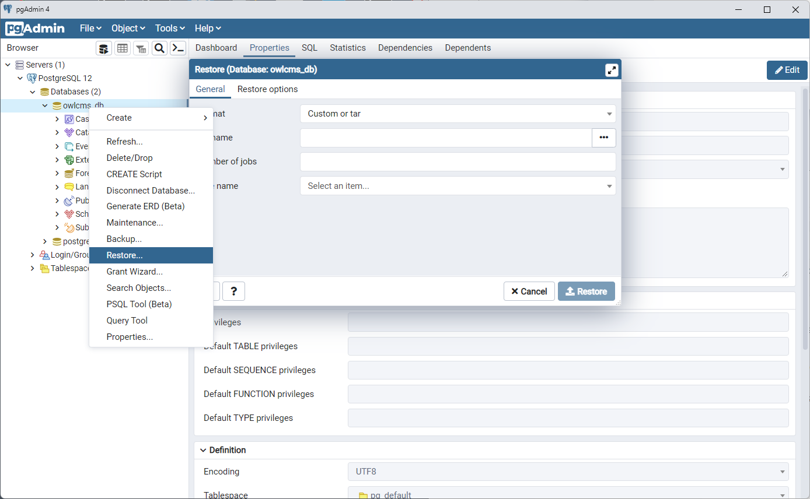
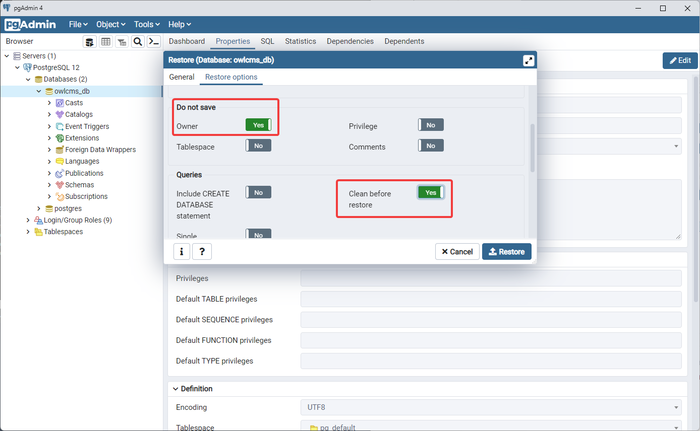

When running on a laptop, a simple database called H2 is used because it does not require installing additional software, and the database is a single file that can moved or transferred easily.

When running in the cloud, files are temporary and disappear when the application is restarted.  The alternative is to use a database provided by the cloud vendor, which is independent from the application and remains when the application is restarted.  Heroku (and most cloud vendors) support PostgreSQL.  Because the owlcms database is small, it fits in the free tier and there is no fee.

You may want to run Postgres locally if you want to use additional properties, such as creating an ODBC connection to the database to perform analytics.

## Initial Configuration of PostgreSQL

1. **Installation** This is only needed once.  Download PostgreSQL version 12 or later from the official site. Install it with the default options. You do not need SiteBuilder option so you can leave that out.
3. **Run `pgAdmin 4`** Run the `pgAdmin 4` program from the Start Menu (it is visible under the PostgreSQL group).  You will be prompted to create a master password, which is used by pgAdmin itself.
4. **Create the `owlcms_db` database** As a matter of principle, we create a separate `owlcms_db` database.    Right click on the `Databases` item, and create a database.  Use the default `postgres` user.
   

4. Add a password to the `postgres` user.  Go to the `Login/Group Roles` section of the database, right click on `postgres` and select `Properties...`  In the `Definition ` tab, create a password.

## Configuring owlcms to Use PostgreSQL

1. **Configuration** In your local installation directory, locate the file `owlcms.l4j.ini`.  At the top of the file, add the following two lines to match the database we just created.
   
    ```
-DJDBC_DATABASE_URL=jdbc:postgresql://localhost:5432/owlcms_db
-DJDBC_DATABASE_USERNAME=postgres
   -DJDBC_DATABASE_PASSWORD=the_password_you_created
   ```
This tells owlcms to use the PostgreSQL database driver, and to connect to the local PostgreSQL server for the `owlcms_db` database using the `postgres` user.
   
2. **Testing**  If you start owlcms, it should now create the default tables in the PostgreSQL database and should open to a new empty competition.  On the very first startup, you may see warnings about missing tables, this is normal because owlcms creates them later in the startup sequence.

3. Stop owlcms

## Restoring a PostgreSQL backup

1. Select the Restore option: Right-click on the owlcms_db database and select "Restore"
   

2. Select the backup file
   

3. Set the restore options to recreate the tables and ignore the Heroku username

   1. Click on the "Restore Options" header.  Scroll down and set "Do not save Owner" to "Yes"
   2. Select "Clean before restore" to remove the existing tables.

   

4. Click on "Restore" to actually restore the backup and overwrite the database.

## Reverting to H2

To return to the standard configuration, you only need to add a `#` character at the beginning of the -D lines to comment them out.
