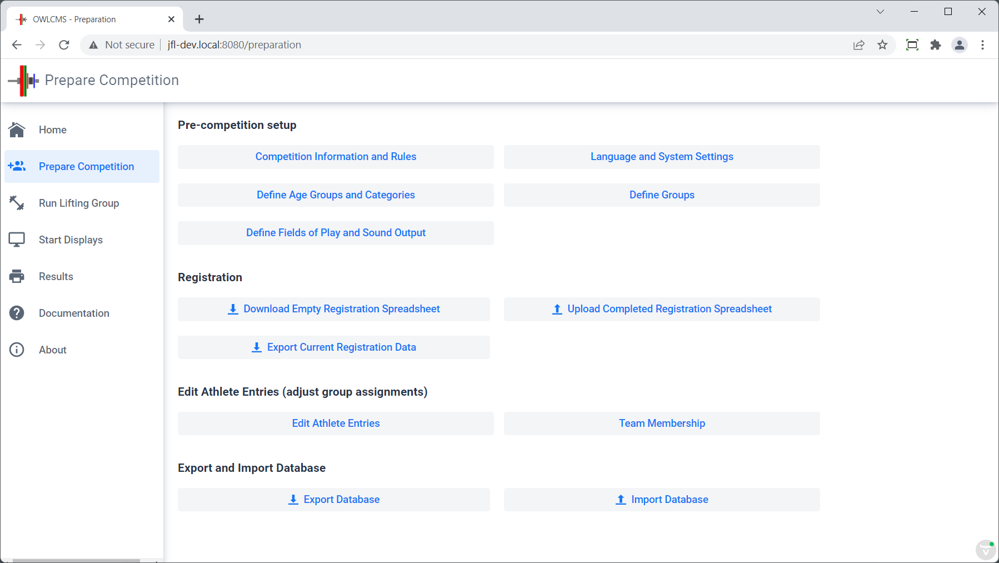
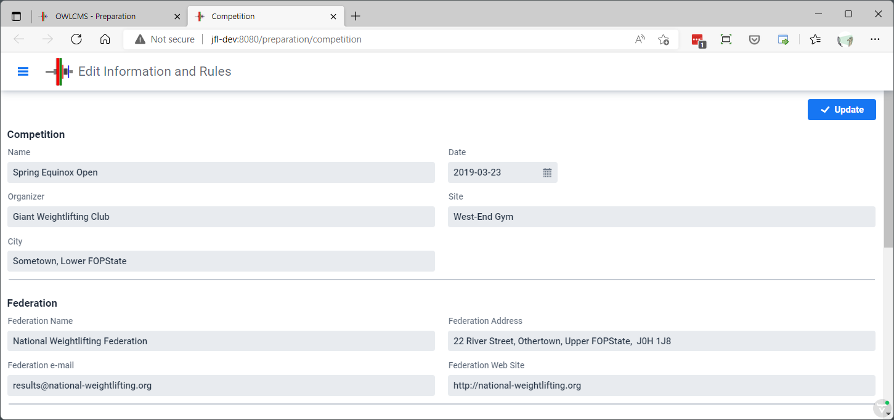
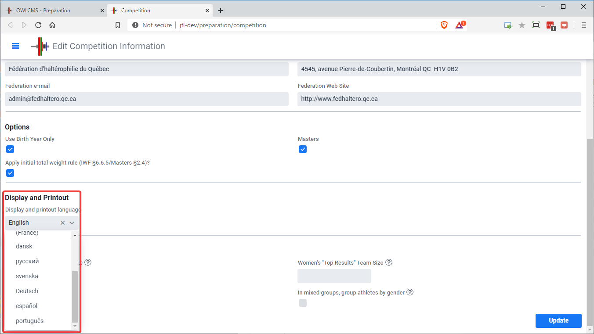
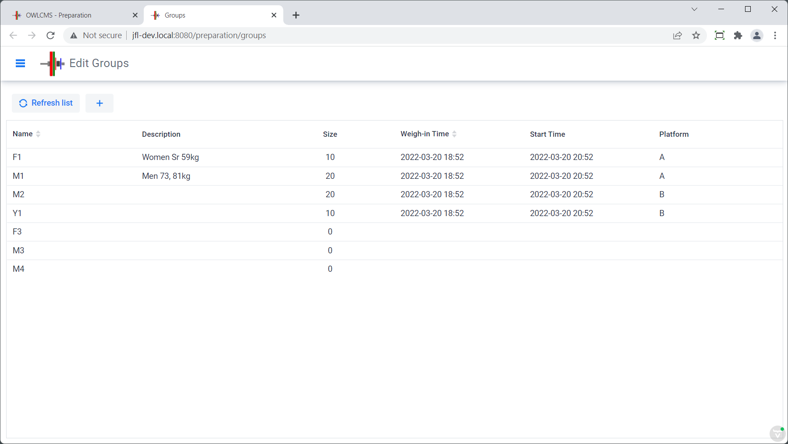
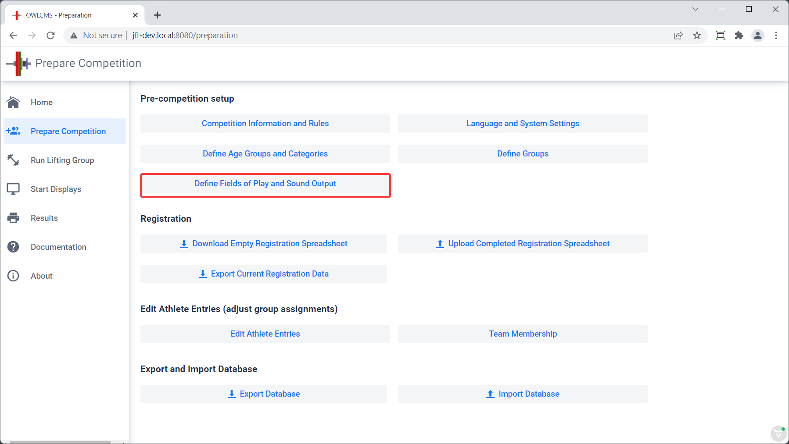

To prepare for a competition, select the `Prepare Competition` menu entry from the `Home` page.

 Using the buttons on the page allows you to setup each of the various aspects required for a meet.

## Competition Information

The `Edit Competition Information` button leads to a page where the information used on the various competition documents is defined.  It also allows options to be set that define the competition behavior.

- The `Apply initial total weight rule` determines whether the 20kg rule (15/10 for Masters) will be enforced.  Some local or regional meets do not enforce this rule.
- The `Use Birth Year Only` allows the use of only the 4-digit birth year for athletes, instead of a full date as required by IWF.

## Masters

This setting is normally used when running a Masters-only competition, and is not required for competitions that have both Masters and non-Masters groups.

- The Masters settings changes the sorting order for displays and weigh-ins -- Masters traditionally start with the older lifters, whereas in an age-group competition the younger age groups are typically listed and weighed-in first.
- The setting also changes which template is used by default when producing results.  Masters use the Sinclair-Meltzer-Faber (SMF) age-ratio rankings to determine the best-in-competition lifter.

The determination to apply the IWF 20kg or the IWF Masters 80% rule is individual, based on whether the athlete is registered in a regular or Masters category.  Therefore there is no need to use this setting unless the weigh-in and presentation order matters.

## Time Zone

When running stand-alone on a laptop, the system gets its time zone automatically according to the computer's settings, so you can skip this section.

But when running in the cloud, the cloud provider typically uses universal time (colloquially, "Greenwich").  So the time shown by the intermission break timer (for example) will most likely be wrong.  Since virtual meets often span several time zones, owlcms needs to be told what time zone was used to create the schedule.

- In most circumstances, including in-person meets, the person setting up the meet is in the same time zone as the competition.  Just use the button (see in red below) to set the time zone according to the current location.  The proposed zone will not necessarily be an exact match to your city -- only a subset of major cities is present in the database.  Just make sure the proposed selection has the same time zone rules as yours.
  Don't forget to click update at the top of the page to save the settings.  
- In virtual meets spanning several time zones, you may need to explicitly select another zone (for example, the organizer is in the Central zone but the competition schedule was published in Eastern times).  You would then use the dropdown to select an appropriate time zone and update the settings.

## Display Language

In countries where more than one language is spoken, and in a virtual meet, the various computers used in a competition are likely to be configured with different languages.  

By default, owlcms will try to use the language indicated by each browser, if a translation is available for that language.  This could be useful in a virtual meet, where officials could come from different countries.

More likely however is the need force a single language to be used on all displays (owlcms will then ignore the individual language preferences sent by each browser).  The display language can be set via a technical configuration (see [here](Heroku#configure-your-time-zone-and-locale) and [here](LocalSetup#id=defining-the-language)), or via the user interface as follows.  After saving the language new pages will appear in the selected language, pages already open will need to be reloaded.

You can unselect the language to revert to "the browser determines the language".

## Defining Age Groups and Categories

Different federations have different rules regarding age groups and the bodyweight categories used in each group.

By default, OWLCMS is set up for an informal club meeting, with no age restrictions and additional light body weight categories for kids.  We will use this simple setup for most of this tutorial.  

In the Default setting, athletes are assigned automatically to a category based on their bodyweight.

OWLCMS also supports the IWF scenarios, and more complex scenarios with multiple age groups, please refer to the [Define Age Groups and Categories](Categories) page for how to proceed for the following cases.
- Official IWF age groups and bodyweight categories.
- Masters competitions, where athletes are automatically assigned to an age group based on their birth date according to IWF Masters rules
- Age Group competitions where regional or national federations define the age group boundaries.

### Editing Competition Groups

From the `Prepare Competition` page, clicking `Define Groups` allows you to create or edit competition groups.  You can use the `+` on the list of groups to create additional groups.

Clicking on a group enables you to define a starting time (remove the information if you do not wish to define it in advance).  You may also enter the officials that will appear on the Excel spreadsheets produced as competition documents.

## Defining Fields of Play (Platforms)

OWLCMS supports multiple competition fields of play used at the same time.  A field of play corresponds to a platform and the corresponding warm-up area.   Displays and officials are associated with a field of play.

The `Define Fields of Play` button on the prepare competition page allows you to list the platforms. 

 Using the `+` button allows you to create additional fields of play.  Clicking once on a platform in the list allows you to edit it.  This is useful if you want to rename the platform, or if you want to change the way sound is handled on that platform.

### Associating an Audio output with a platform

Normally, the decision and attempt board on each field of play will emit sounds for the various timer warnings and for the down signal.  However, in certain circumstances, this may not work (for example, some computer-browser combinations produce garbled sound).  You can then use the main laptop to produce the sounds instead (which is how owlcms2 operated).  This is done by using a dropdown on the platform editing card. 

Notes:

- if you need to produce sound from the main laptop for more than one platform, you will need one audio output per source.  The easiest way to add more (in addition to the audio headset jack) is to use an [*analog* USB converter](https://www.amazon.com/UGREEN-External-Headphone-Microphone-Desktops/dp/B01N905VOY/ref=lp_3015427011_1_5?s=pc&ie=UTF8&qid=1564421688&sr=1-5) -- do not use digital or wireless connections, they introduce perceptible lags and are needlessly expensive.  The various adapters available will appear in the list, you need to assign each platform with an adapter.
- This technique does not work if you are running OWLCMS in the cloud.  In that case, find a computer with proper sound, and run the attempt board on that computer.  Just make sure that the attempt board is running in its own browser window, and that it is the selected tab.  You can bring other windows in front, the attempt board will still emit the sounds.

