Normally, `publicresults` is installed in the cloud.  If you have no Internet access and would still like the coaches to have access to the scoreboards, you can use a setup like the following.

> NOTE: local setups are complicated, because you want to keep the competition network safe.
> This is why it is generally *much* easier to use a cloud-based setup for publicresults -- all the safekeeping is done by the cloud provider.

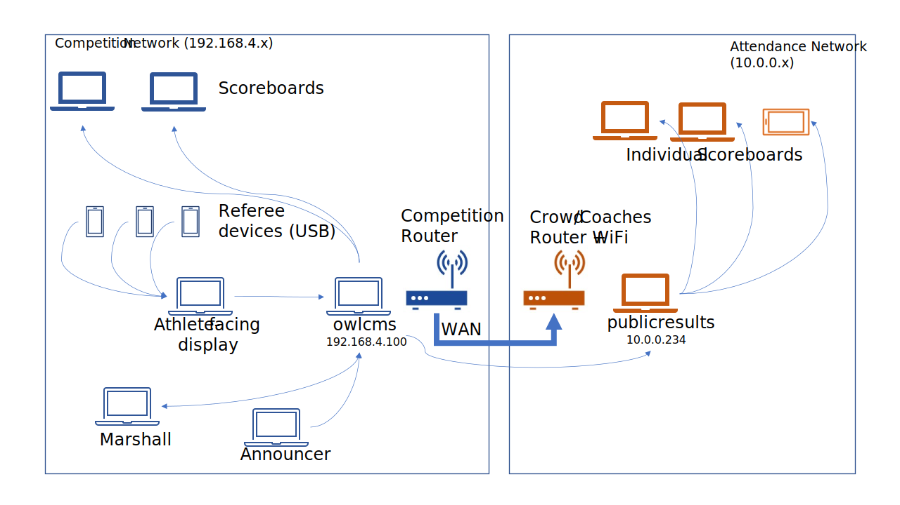

### Making `publicresults` accessible from `owlcms`

We use two routers so we can use two separate Wi-Fi networks on-site, one for the competition network, the other for the coaches/public.  This is important for safety and router capacity reasons. Because of this, `owlcms` cannot directly see the publicresults laptop, and we need to make it visible.

The following example uses an ASUS router as an example.  Modern routers have the equivalent features, please refer to the documentation for your router.

1. Connect the `publicresults` laptop to the secondary router.

2. Connect the secondary router to the primary router.  The primary router will give the secondary router an address on the primary network.  

3. Make sure you know the administrative password of your secondary router, and that you know its IP address (typically, new routers are 192.164.0.1, or 10.0.0.1).  Make sure that you can reach it from the publicresults laptop.  In this example, the address of the secondary router is 192.164.4.1, so we connect to it using http://192.164.4.1

   - We see that the primary router gave the secondary an address 10.0.0.234 .  We will need this address later.  In our diagram, all the machines on the left-hand side cannot see the right-hand side.  All they see is the secondary router using the 10.0.0.234 address.
   - The secondary router is a double-agent.  It has addresses on both networks.  Coming from the right-hand side, it is known as 192.168.4.1 (see the purple box below).  This is because the secondary router is actually the boss on the right-hand side.  It was configured to use 192.168.4 as its network, so all machines on the right-hand side get addresses that start with 192.168.4.

   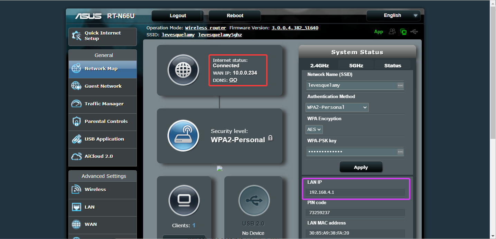

4. We now need to find the address of the publicresults laptop in the secondary router network.
   You can go to the laptop and use the `ipconfig` command.  

   In our case, we can actually see the addresses direclty on the secondary router. The publicresults laptop is 192.168.4.234  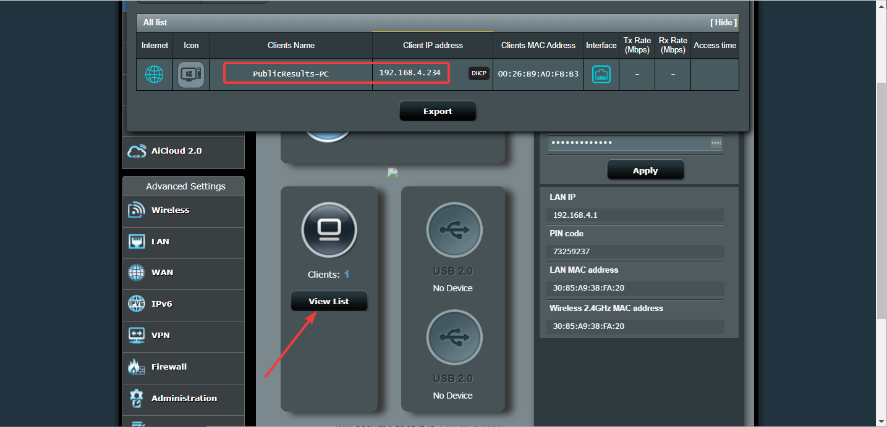

5. The secondary router is a gatekeeper -- it prevents anyone on the primary network from seeing the secondary network machines.
   So we need to explicitly tell the secondary router to let the updates coming from owlcms go to the publicresults program.  This is done via "port forwarding".

   - We add a port forwarding rule that tells the secondary router to take any information it gets on its port 8080 and forward it to the port 8080 of the publicresults laptop.  This is where the publicresults program will be listening.    

   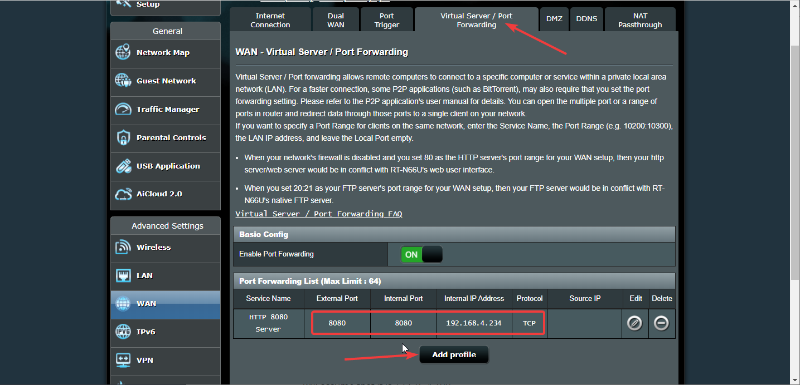

### Configuration and test

1. We need to configure publicresults so that it has a shared secret with owlcms
   Go to the file location for publicresults and edit the `publicresults.l4j.ini` file.
   Make sure it has a line that defines the secret

   ```
   -Dupdatekey=SomeVeryLongStringYouWillConfigureAlsoInOwlcms
   ```

2. Configure owlcms

   - set the destination url for publicresults to the port forwarding address (http://10.0.0.234:8080 in our example)
   - set the shared secret update key to what you used in the l4j.ini file (SomeVeryLongStringYouWillConfigureAlsoInOwlcms in our example)

3. As explained above, from the primary network, the secondary router is visible as 10.0.0.234 .  If owlcms now sends information to http://10.0.0.234:8080 the secondary router will get it, turn around, and forward it to the publicresults machine because of the port forwarding rule.
   We can test this by going to the owlcms laptop and using the port forwarding address.
   

4. You can now test actual updates from the owlcms application.
   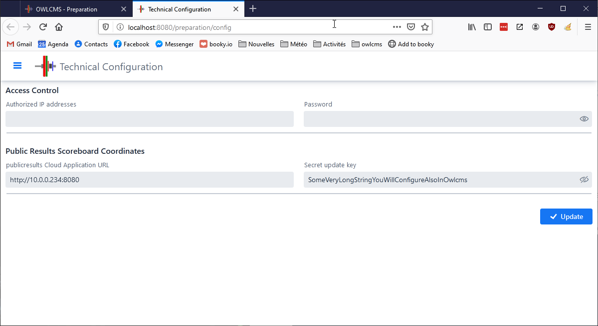

### Protecting `owlcms` : Options

When you are at home, the various laptops, tablets or phones you connect to your router are all able to open connections to the Internet.  But the machines on the Internet cannot open connections to your machines at home.

In our setup, the primary network is like the Internet: any machine on the secondary network can actually connect to the primary network.  So any vandal that can figure out what the address to owlcms could potentially mess with it -- a disgruntled competitor perhaps.  We don't want that, so we need to prevent access to the owlcms application.

#### Option 1: Protecting the competition network

The safest option would for the primary network to restrict traffic coming from the secondary network.  Unfortunately, when using domestic-grade routers, this cannot always be done easily.  However, many routers have options to restrict traffic to the "internet" (which in our case ), so we can usually use the secondary router to block traffic going to the competition network.

For example, many routers have features to block or filter services.  You can look at "Network Services Filter" or similar wording, and prevent traffic from flowing out of the secondary network to the WAN/Internet on ports 80 and 443 (for the secondary network, the WAN/Internet is actually the competition network)

#### Option 2: Windows Firewall

If we cannot block traffic to the primary network, we can protect the owlcms application itself instead.  We will use the Windows firewall on the owlcms laptop to protect us.

1. Click on the Windows icon at the bottom left, and select the Settings icon above it (gear-shaped icon)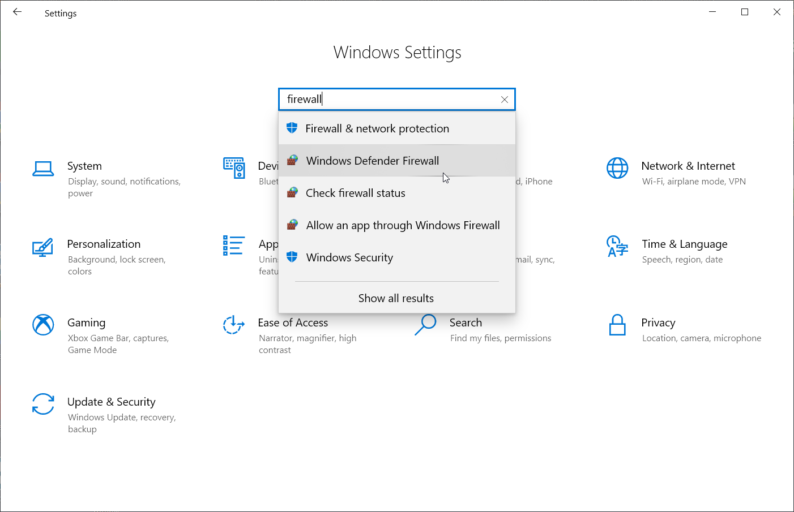

2. In the next window, select "Advanced Settings" on the left-hand side.
   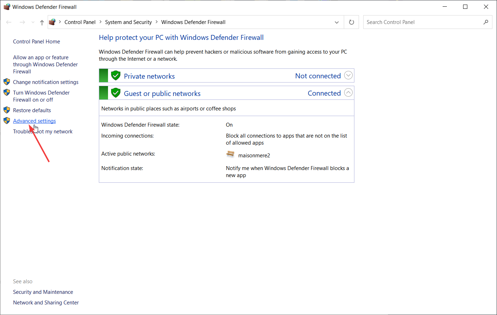

3. Click on "inbound rules", click on the "Name" column to sort, select all the "java.exe" rules and <u>Delete</u> them.  It is possible that there are no such rules, in which case there is nothing to do.
   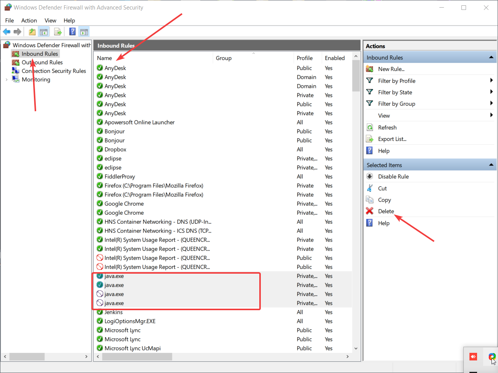

4. Leave the firewall window open.
   Start owlcms.  You should see a Security Alert.  Make sure that BOTH private and public are selected.
   

5. Go back to the firewall window.  Hit "refresh".  You should see two entries for "java.exe".

   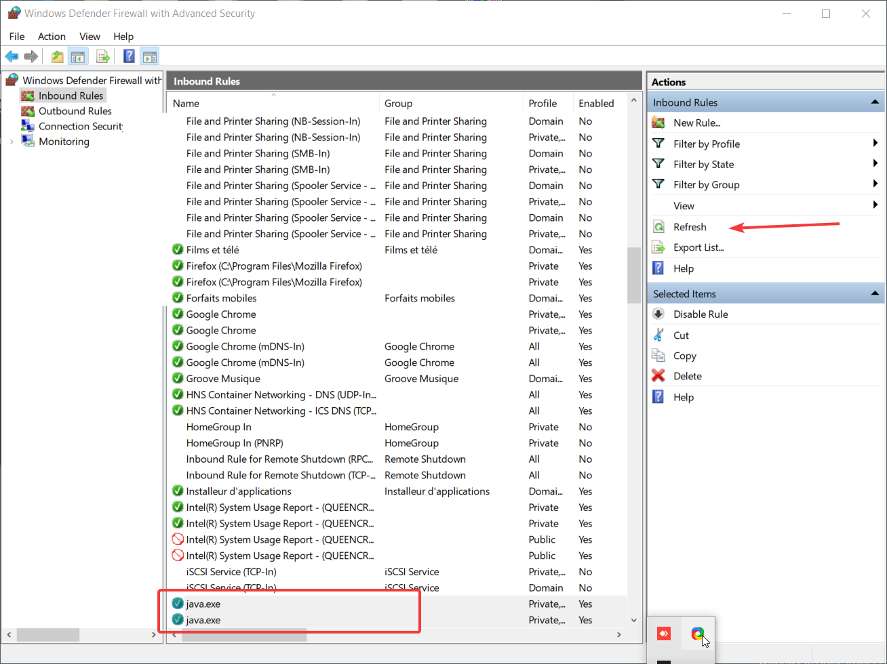

6. Click on both of them.  There is a "Protocol/Port" tab.  We want to edit the one with "TCP" as protocol.
   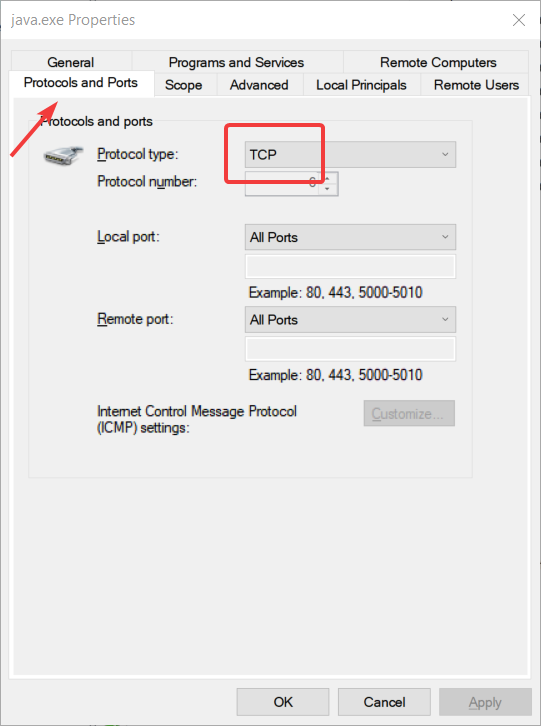

7. In order to prevent an error message in the next step, we go to the "Advanced" tab. This action should in theory be sufficient to do all we want, but alas, this is not the case.  In the bottom drop-down list, select "Block Edge Traversal"
   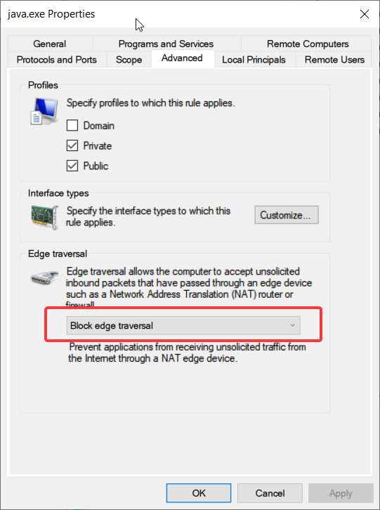

8. We now move to the "Scope" tab.  We need to allow all the machines on the primary network *except* for the secondary router.  All the people on the secondary network trying to reach owlcms would look like they come from the secondary router so we want to exclude them.

   - Windows Firewall exclusion rules don't work correctly in this case, so we have to use explicit inclusion rules.
   - In our example, the secondary router is 10.0.0.234, so we have to allow from 10.0.0.2 up to10.0.0.233 and 10.0.0.235 up to 10.0.0.253.
   - Windows is also confused about the notion of public and private (it thinks that 10.x.x.x is public, even though it is not), so we need to do this twice, for the public and private sections.

    

9. After adding the 4 ranges, the dialog should look similar to this (obviously, using your own addresses).
   For example, if your secondary router is 192.168.0.102, the ranges would be 192.168.0.2 to 192.168.0.101 and from 192.168.0.103 to 192.168.0.253.
   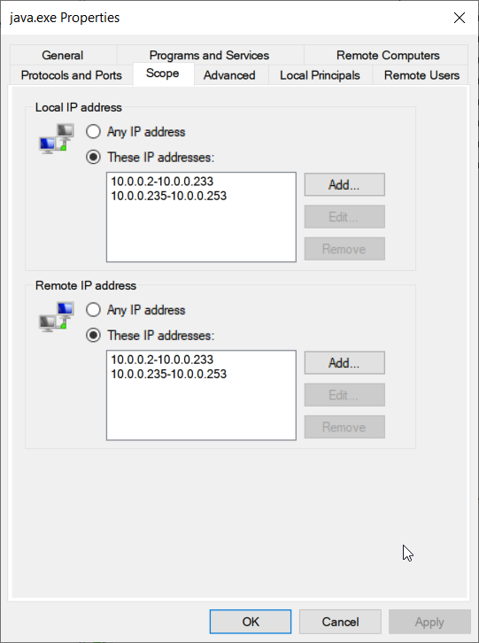