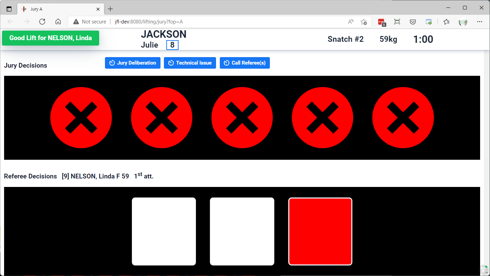

# Refereeing

OWLCMS supports using refereeing devices, and also supports 3 and 5-person [Jury](#Jury). Refereeing and Jury screens are started from the lifting page as shown below.  However, the decisions are displayed to the public and athletes on the displays started on the [Start Displays](Displays) page.

Refereeing can be performed in 3 different ways

- With no technology.  Decisions are made using flags, colored cards, or hand signals.  
- With mobile devices (typically, a cellular phone or a tablet)
- With buttons connected to the athlete-facing decision display (or an attempt board)

## Manual Refereeing

The announcer announces the decision and uses the buttons at the top right of his screen to register the decision.

## Mobile Device Refereeing

 The referee console is started from the "run a lifting group" page, or by adding /ref to the URL for the competition site.  For example https://owlcms4.herokuapp/ref  leads to the referee application.  After starting the referee screen, it is necessary to select which referee is which (1, 2 or 3) using the numeric input at the top (use the + and - signs)

The selection is confirmed by greying out the other key.  The refereeing display is reset when an athlete gets fresh clock.

## USB or Bluetooth Keypads

In this approach, keypads are connected to the laptop or mini PC running the timer/decision display (or the attempt board, both work the same).   There are two advantages to this approach:

1. Many referees prefer having their finger rest on a button (which is not possible on a phone)
2. The sound and down arrow are emitted directly by the browser, without any round-trip to the master computer.  This reduces delays and increases reliability if the networking is fragile (which is sometimes the case in gyms)

The keys or buttons on the keypads are programmed to send key sequences.  The decision display is waiting for these keypresses.  You must click in the black area to make sure that the keypresses are seen by the browser.

- 1 will be interpreted as a white from referee 1, and 2 will be interpreted as a red. 

- 3 will be interpreted as a white from referee 2, and 4 will be interpreted as a red.  

- Finally, 5 will be interpreted as a white from referee 3, and 6 will be interpreted as a red.

  ### Notes for Raspbery Pi users with Delcom keypads

  If you bought industrial-strength Delcom keypads (shown in the picture above) **and** are connecting them to a Raspberry Pi,  be aware that Delcom has unfortunately [introduced a bug in its device drivers](http://www.delcomproducts.com/webnote.asp?id=3) that prevents the operating system from recognizing their devices on *Raspberry Pi* (and likely other Linux distributions).

  To emphasize, there is **no** **issue** with using the Delcom keypads on Windows or ChromeOS laptops.  Indeed, the picture above shows a Windows miniPC.

  Unfortunately, the workarounds proposed by Delcom by only work for newer devices.  If you have Delcom keypads with firmware older than version 52, and need to use them with a Raspberry

  - Please see https://github.com/jflamy/rpi-delcom-legacy for an alternate operating system image that solves the problem of recognizing the devices.  This image does not support Raspberry 4.
  
  - The alternate OS is unfortunately very bad for sound, so
  
    - You will however need to use the "Define Fields of Play" button in the "Preparation" section to select an audio output on the master laptop **OR**
    - Plug your speakers in a non-raspberry attempt board.  
  
## Jury

In order to use a jury, in the current version, you need 3 or 5 refereeing devices connected to the computer with the Jury console.

The devices are programmed just like for the referees, except that jury 4 uses keys 7 and 8, and jury 5 uses the keys 9 and 0.  As for the referees, even-numbered keys mean "red".

The jury console operates according to IWF rules: the referee decisions are shown as soon as they are made, in the bottom part of the screen.  In the top part of the screen, the decisions circle for a jury member shows that he or she has made a decision, but the individual decisions are only shown in red or white after they have all been given.

