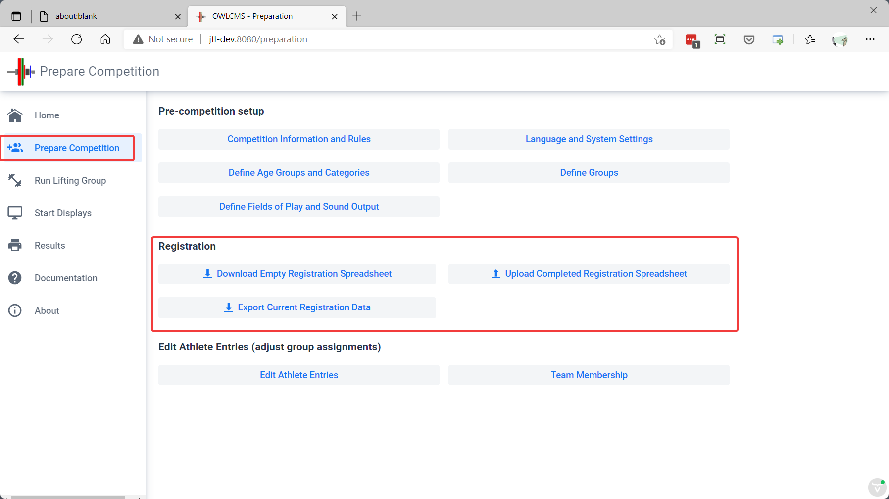
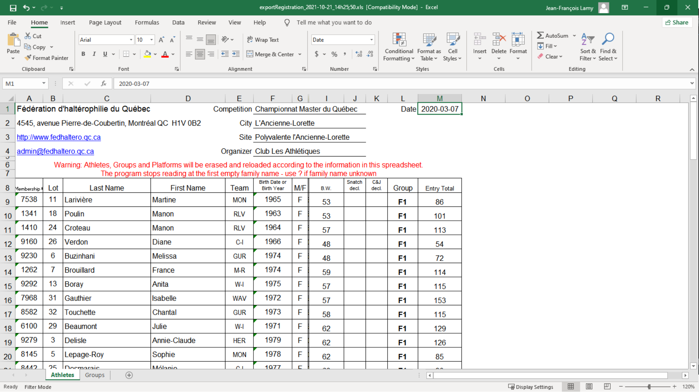

The next step in preparing a competition is registering the athletes.  This involves

- Entering the list of all participating athletes
- Drawing lots
- Assigning athletes to groups
- Producing a start list
- Producing Athlete cards

These steps are performed from the `Prepare Competition` page

## Clearing athletes from a previous competition

If you have more than a dozen athletes, we suggest that you enter your athletes using an Excel spreadsheet (see below), and this step is not necessary.

In order to clear the database from a previous competition, use to the **`Edit Athlete Entries`** button on the `Prepare Competition` page.   At the top of the page, use the `Delete Athletes` button and Confirm.

## Uploading a list of athletes

Because entering athletes is tedious, it is easier to upload a list prepared with Excel which allows copy-and-paste in an easier way.  

1. Getting started. Obtain an up-to-date empty form to capture information. The format is occasionally updated, so it is always best to get the current version. 
   From the `Prepare Competition` page, click on the `Download Empty Registration Template` button.  Open the downloaded file and **SAVE IT** somewhere in your own documents.

   

   Note: If you have an existing database and want to start from that list, you can export the current content.

2. Fill-in the Excel with the information about your athletes.  
> - For each athlete, you need to provide at least the birth year, the gender, and the expected body weight.
> - The program will automatically assign the athlete to the age groups and categories where he or she is eligible. If you have multiple overlapping age groups (for example IWF Junior and Senior) present, the athlete will be added to both categories.  If there are additional eligibility requirements that mean an athlete is not eligible, you can remove the eligibility using the registration page in the program.
> - This will set the weight of the athlete in the program.   You can export the list of athletes, clear the weights, and reload.  If there is no weight but the category is present, the category will be kept.

3. When entering dates and times, <u>please use the same format as the one proposed</u> by the Excel sheet.

   

4. The groups that you list on the "Athletes" tab should be defined on the second "Groups" tab.  The minimum is to provide the group code.

   > - The program will create groups with the code names you use.  You can use numbers, or any short combinations.  Some people use the categories present in the group (ex: M81B-M77A)
   > - When entering dates and times, <u>we recommend that you use the format that Excel shows you</u> (which may vary based on your Office and operating system settings).  The program will also accept an international `yyyy-MM-dd hh:mm`  format (4-digit year, month, day, 24-hour hour, minutes) as an alternative.

   

5. Upload the completed form.  Note that this **deletes the previous athletes and groups**.

   > The recommended practice is to keep the Excel registration sheet until the verification of final entries is done.  You can then move athletes from group to group and adjust their entry total faster on the sheet.
   >
   > The Excel sheet should contain all the athletes that will compete.

6. Fix errors, if any. If there are errors detected on the upload, they will be shown (for example, unreadable dates in a cell, or a missing group).  The athlete will still be created, but without the faulty information.  You can either upload again after correcting.  If you use the program to fix the errors, make sure you export the information so you can reload it later.

## Reloading information

If you need to make important changes, such as adding a new team of athletes, reorganizing the groups, and so on, you can export what you have already loaded back to an Excel sheet, do the changes in Excel, and reload.

As stated earlier, this will recreate the athletes and groups from scratch, so this needs to be done *before* the competition.

## Adding or Editing Athletes after loading

In order to add or edit athletes, use again the `Edit Athlete Entries` button on the `Prepare Competition` page.  Above the list of athletes, using the `+` button allows you to add an athlete, whereas selecting an existing athlete by clicking ONCE allows you to edit.

You may then fill the form.  The eligible categories will be computed automatically, and if the athlete is eligible to several categories the most specific category will be assigned based on the age (this is in order to compute start numbers, and will be used on scoreboards).

The `Eligible for individual ranking` checkbox is used to determine whether the athlete is eligible for medals or is competing "out-of-competition".  Some meets may allow an athlete from another jurisdiction to compete in order to meet a qualification requirement, but not include the athlete in the medals.

## Drawing lot numbers

After all athletes have been entered, you should draw the lot numbers.  You can also assign lot numbers manually for late registrants by editing the athlete's entry card.

## Producing the Start List

The starting list shows all the athletes that will compete, in which group, and the order in which the athletes will be weighed-in.  The button for producing the starting list is at the top of the page.

## Athlete Cards

Athlete Cards are the cards that will be used by the Marshall to record changes.  In many federations, they are printed out in advance, because the athletes will be asked to write down their starting weights and counter-sign their body weight at weigh-in.  

If athlete cards are printed in advance of the weigh-in, the start numbers are not known.  They are written by hand on the cards after they have been assigned at weigh-in.  This is usually done by the competition secretary, comparing the [Starting Weight List](#starting-weight-list) as a reference and cross-check.

 The button for producing the athlete cards is at the top of the page.  You can restrict the printing to a group by selecting it in the drop-down.  The cards are printed two to a page.

Note that if a printer and laptop is available at the weigh-in room, it is also possible to print individual weigh-in sheets one athlete at a time.

