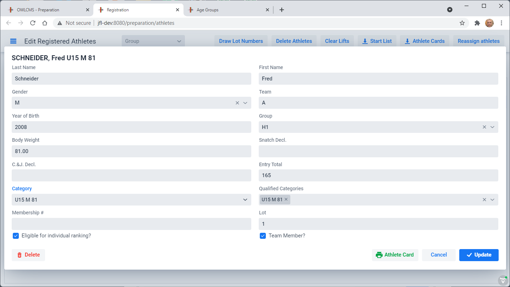
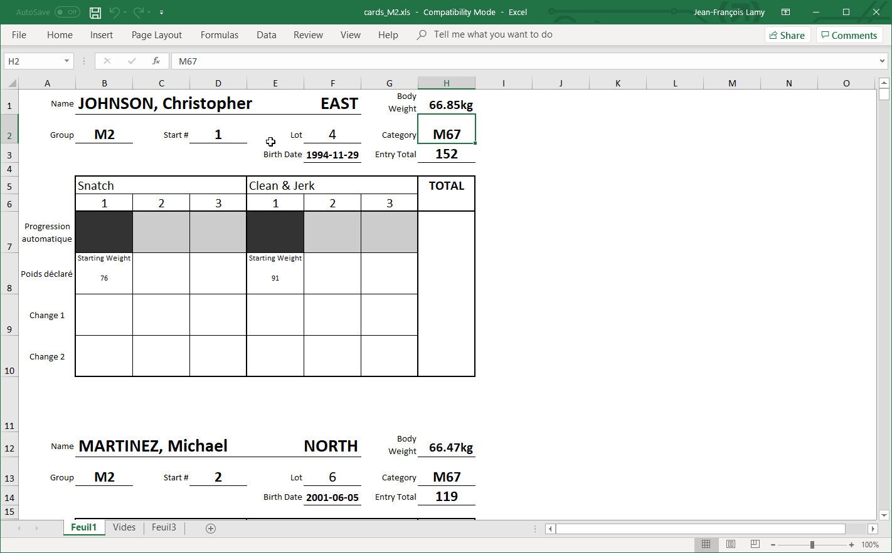

The next step in preparing a competition is registering the athletes.  This involves

- Entering the list of all participating athletes
- Drawing lots
- Assigning athletes to groups
- Producing a start list
- Producing Athlete cards

These steps are performed from the `Prepare Competition` page

## Clearing athletes from a previous competition

Unless you are running from a new installation, your database will contain information from the previous competition.  In order to clear the database, use to the **`Edit Athlete Entries`** button on the `Prepare Competition` page.   At the top of the page, use the `Delete Athletes` button and Confirm.

## Uploading a list of athletes

Because entering athletes is somewhat tedious, it is easier to upload a list prepared with Excel which allows copy-and-paste in an easier way.  In order to do so, three steps are involved

1. Obtaining an up-to-date form to capture information.  From the `Prepare Competition` page, click on the `Download Empty Registration Template` button.  Open the downloaded file and **SAVE IT** somewhere in your own documents.

   

2. Fill-in the Excel with the information about your athletes.  Assign each athlete to a group and a weight category. Note that this is a presumed category, for the purpose of creating your groups.  
   
> - When you load the file, the program will assign the athlete to the age groups and categories where he or she is eligible. If you have multiple overlapping age groups (for example IWF Junior and Senior) present, the athlete will be added to both categories.  You can instead put the expected body weight if you prefer.
   > - The program will create groups with the code names you use.  You can use numbers, or any short combinations.  Some people use the categories present (ex: M81B-M77A)

3. Note that the Date must be entered as an Excel Date using your regional settings.

   

4. Upload the completed form.  Note that this **deletes the previous entries**.

   > The recommended practice is to keep the Excel registration sheet until AFTER the verification of final entries.  You can move athletes from group to group and adjust their entry total faster on the sheet.
   >
   > You should therefore **keep all athletes from all groups** on your Excel

5. Fix errors, if any. If there are errors detected on the upload, they will be shown (for example, wrong category codes).  The athlete will still be created, but without the faulty information.  You can either upload again after correcting and clearing, or fix by hand (see below)
   

## Adding or Editing Athletes after loading

In order to add or edit athletes, use again the `Edit Athlete Entries` button on the `Prepare Competition` page.  Above the list of athletes, using the `+` button allows you to add an athlete, whereas selecting an existing athlete by clicking ONCE allows you to edit.

You may then fill the form.  The eligible categories will be computed automatically, and if the athlete is eligible to several categories the most specific category will be assigned based on the age (this is in order to compute start numbers, and will be used on scoreboards).

The `Eligible for individual ranking` checkbox is used to determine whether the athlete is eligible for medals or is competing "out-of-competition".  Some meets may allow an athlete from another jurisdiction to compete in order to meet a qualification requirement, but not include the athlete in the medals.

## Drawing lot numbers

After all athletes have been entered, you should draw the lot numbers.  You can also assign lot numbers manually for late registrants by editing the athlete's entry card.

## Producing the Start List

The starting list shows all the athletes that will compete, in which group, and the order in which the athletes will be weighed-in.  The button for producing the starting list is at the top of the page.

## Athlete Cards

Athlete Cards are the cards that will be used by the Marshall to record changes.  In many federations, they are printed out in advance, because the athletes will be asked to write down their starting weights and counter-sign their body weight at weigh-in.  

If athlete cards are printed in advance of the weigh-in, the start numbers are not known.  They are written by hand on the cards after they have been assigned at weigh-in.  This is usually done by the competition secretary, comparing the [Starting Weight List](#starting-weight-list) as a reference and cross-check.

 The button for producing the athlete cards is at the top of the page.  You can restrict the printing to a group by selecting it in the drop-down.  The cards are printed two to a page.

Note that if a printer and laptop is available at the weigh-in room, it is also possible to print individual weigh-in sheets one athlete at a time.

