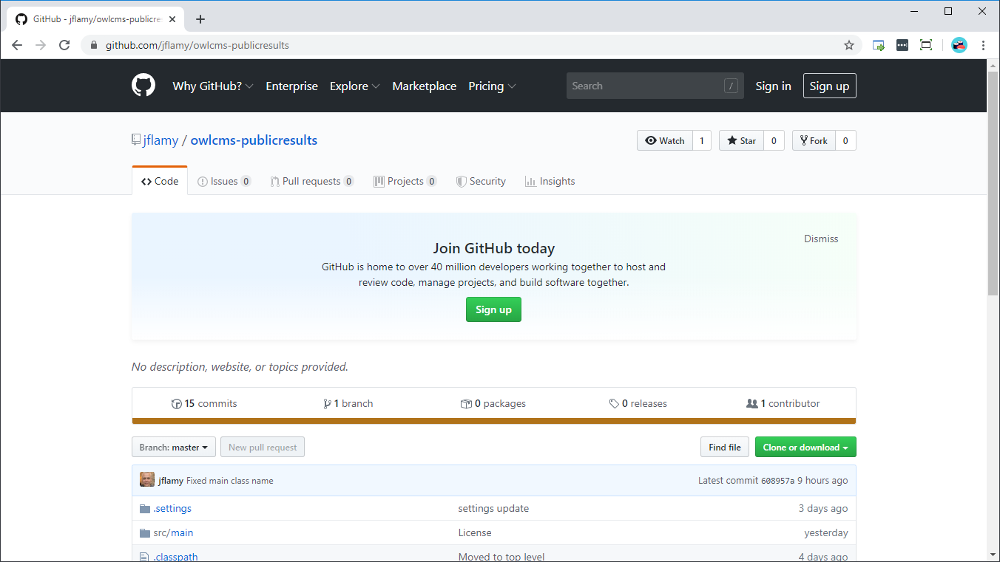
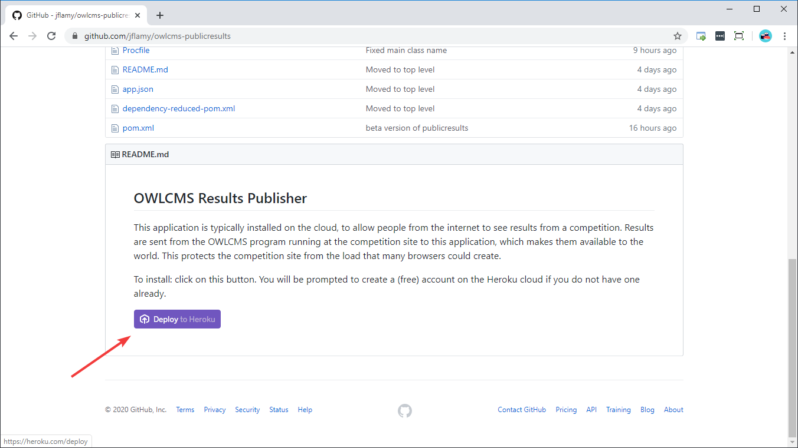
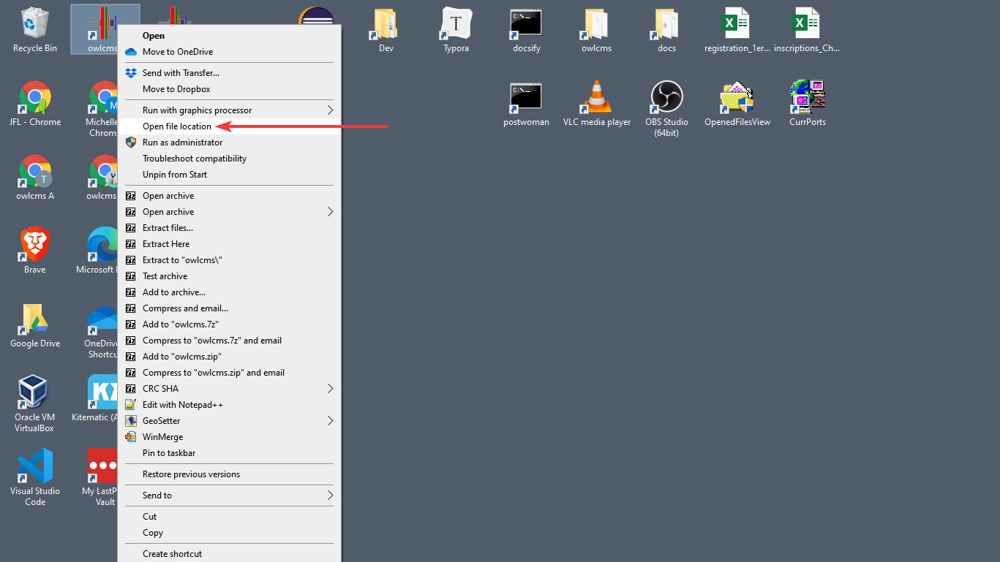
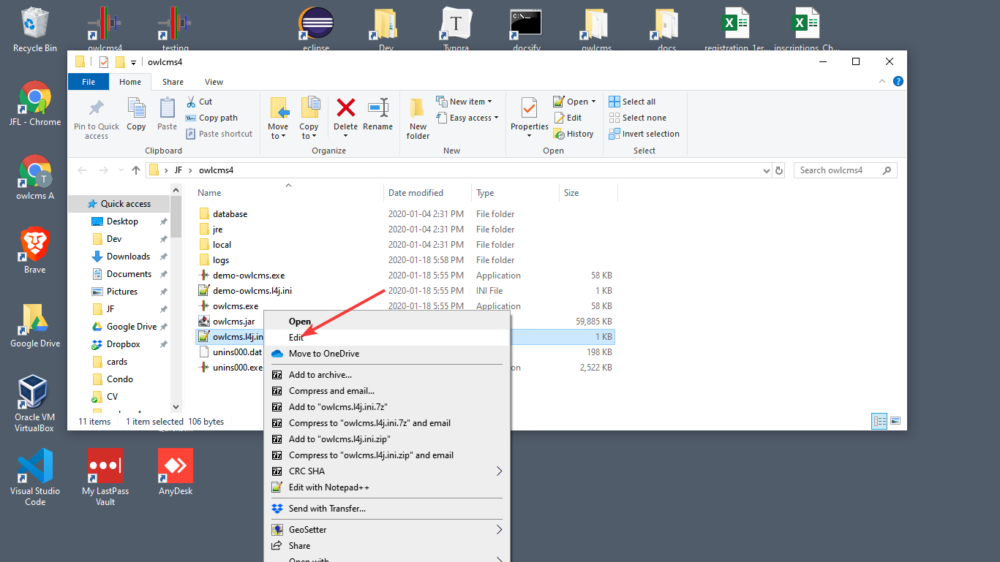
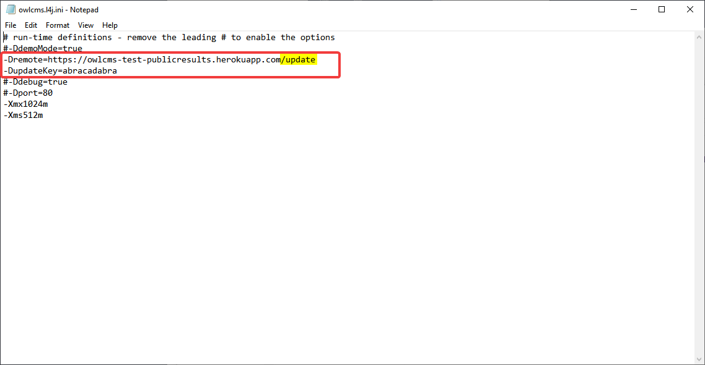
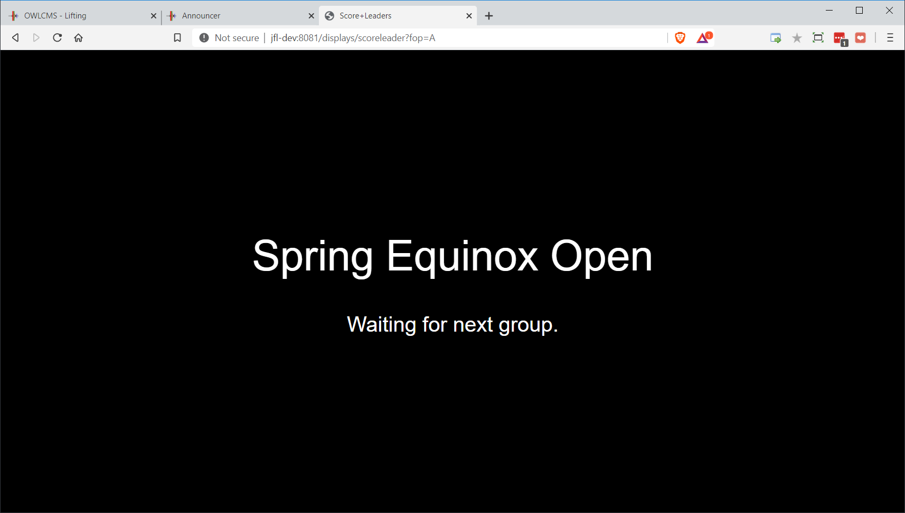
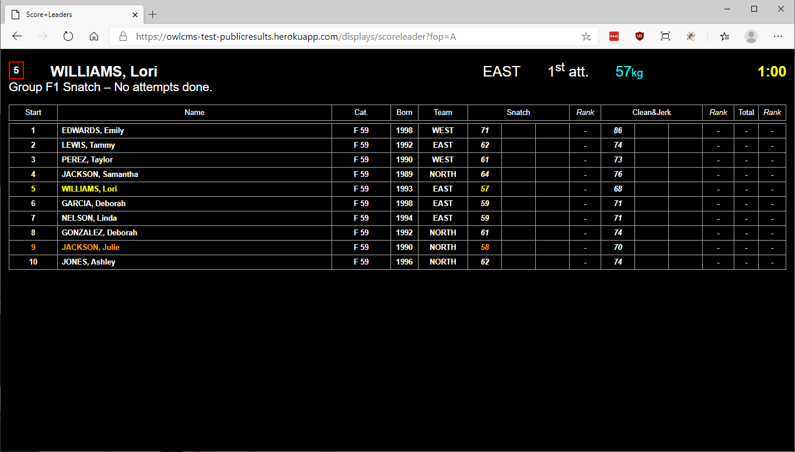
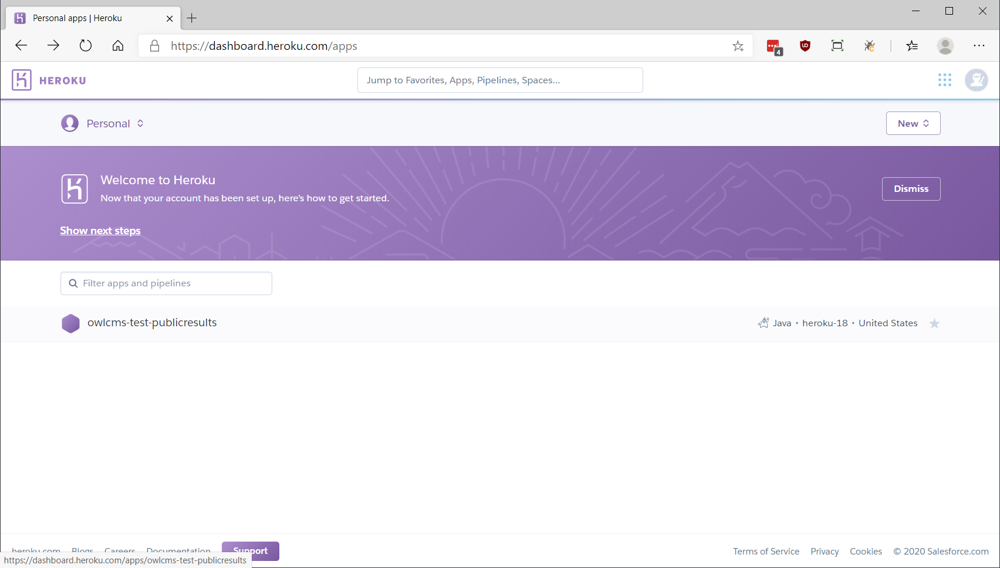

The remote Public Results application is used to make applications results available to the public at large.

The information is sent from the competition site to an application running on the cloud.  The general public, whether at the competition site or anywhere on the internet, can access the scoreboards via their phone or laptop.  There is no load put on the competition site other than sending an update to the remote application.  The remote application takes all the load for the public queries.

## First-time Install of the Public Results Application

1. Get a free Heroku account -- go to [https://heroku.com](https://heroku.com) and sign up!
2. Go to the github repository for the public results application [https://github.com/jflamy/owlcms-publicresults](https://github.com/jflamy/owlcms-publicresults) and scroll all the way down to the end of the page.
    
3. Use the `Deploy to Heroku` button.  Enter your Heroku account (or create one if you haven't)
    
4. Choose a meaningful application name.  This is what the public will see (unless you use the Heroku options to map your application to a name your club or federation owns, but this is beyond the scope of this tutorial)
    
5. Deploy the application. "Deploy" means : copy the code for the application from the master repository, fetch the required libraries, build everything, and make the result available.
    
6. You can now view the public results application
    
7. The application is just sitting there, waiting.
    
8. In order for the public results application to display anything, it expects a secret code to be sent by the competition site.  We now configure the secret code that will be required as a configuration variable.  This is done on the `Settings` screen.
    
9. We define a configuration variable `OWLCMS_UPDATEKEY` to contain the expected secret.  **Use something easy to type, but very long**, and not easily guessed.  `abracadabra` is therefore **NOT** a good real-life example.
    

## Configure the competition site to send updates

1. Open the file location where OWLCMS4 is configured.  These instructions are for Windows; the equivalent steps for Mac and Linux are performed by adding the options to the `java` command line.

1. Edit the .ini configuration file using Notepad.

1. At the top of the.ini  file, use Notepad to add the values according to the following format
``` 
-Dremote=https://owlcms-test-publicresults.herokuapp.com/update
-DupdateKey=abracadabra
```
- Notes:
  ​    **use your own site** -- replace `https://owlcms-test-publicresults.herokuapp.com` with your own application.
  ​    Make sure that the value for `-Dremote=` **ends with `/update`** 
  ​    **use your own secret** that you defined on the server application
- You should therefore have something similar to the following in your file


## Running a competition with a remote public scoreboard

1. Start the remote application.  Just accessing the URL will restart the application if it was dormant (on the free Heroku subscription, the remote application will go to sleep if unused for an hour).  During a competition, there will be frequent updates, so there is no chance of this happening. 
2. Start the competition site application as usual, and get the the announcer to select a group,
   
1. The public results application will now show that there is a platform active.

1. Clicking on that link leads to the blank scoreboard, since there is neither a break neither lifting going on. 

1. As soon as a break or lifting starts, the competition site updates the remote application accordingly every time something pertinent happens.

## Updating the application
When testing in the days leading to a competition, it is wise to update both the OWLCMS4 application and the remote public results server.
In order to update the public results server, use the following process
1. Log on to Heroku

2. Go back to the Deploy page

3. (First time only) The *first* time you want to update, you will need to connect your application with the master.  The first time around, when using the deploy button, only created a copy, but did not link it back permanently to the source.  Click on the "Connect to Github" button

1. (First time only) If you have not done so previously, create your free github account (needed to connect to the current version of the code) and perform the confirmation steps required (typically, confirm your email)

1. (First time only) You will now be allowed to select the repository for the Public Results application.  Choose it as illustrated (under jflamy, choose the owlcms-publicresults repository)

1. Go down the page and click `Deploy`

1. The application will be rebuilt and deployed.
