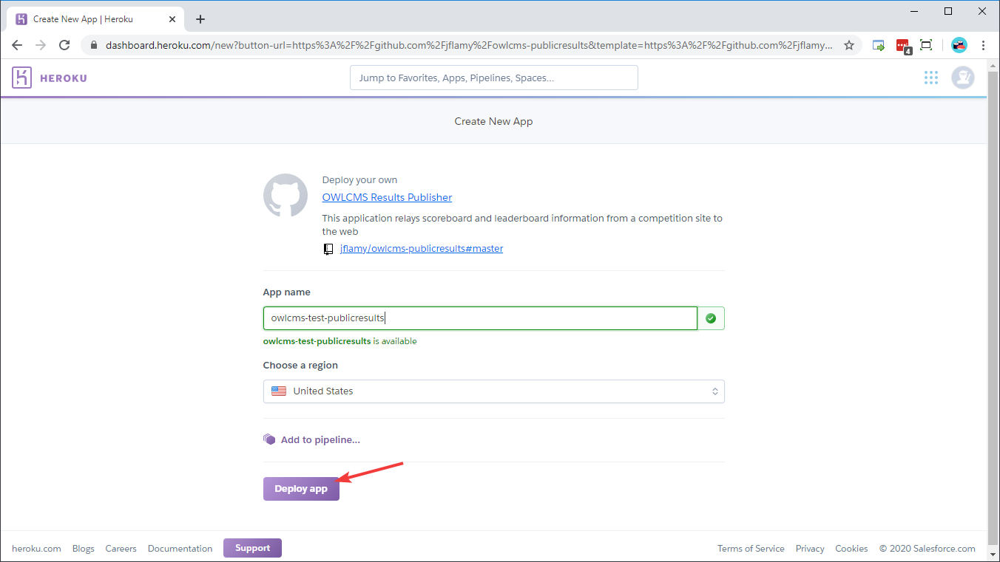
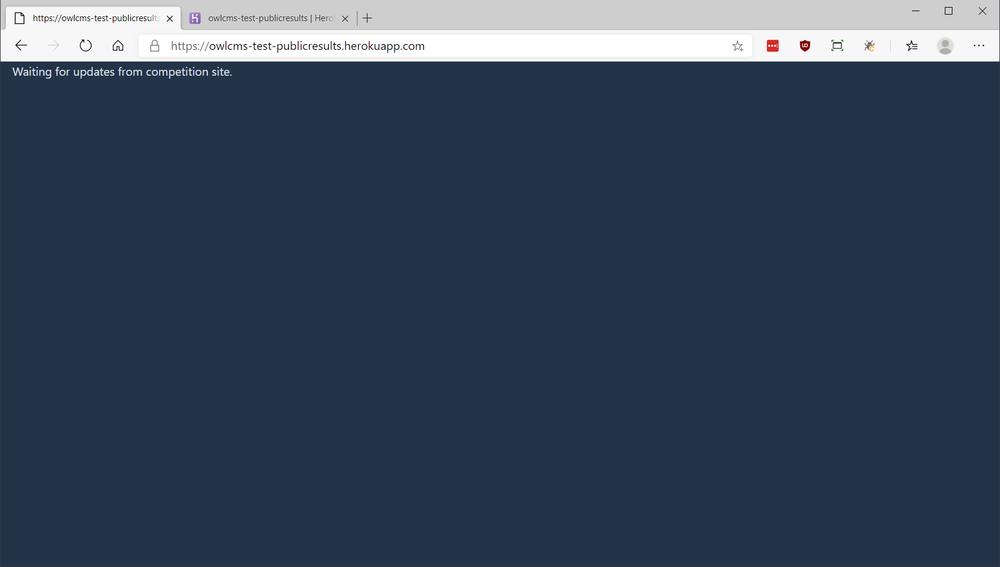
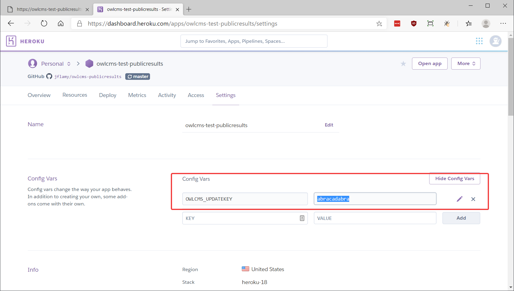
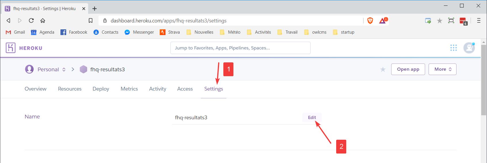
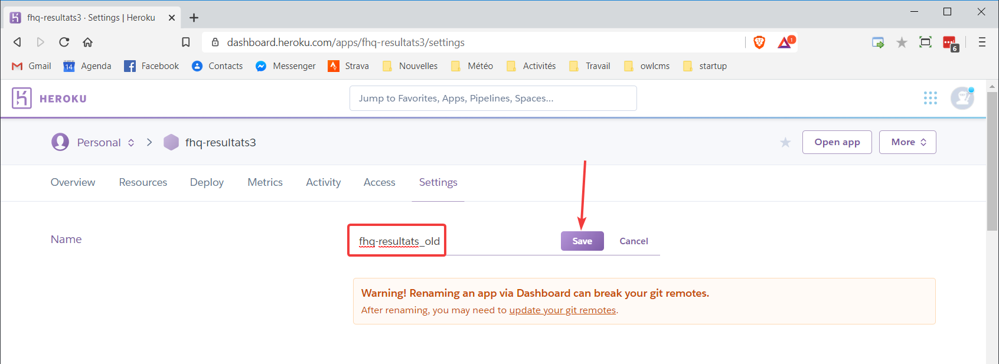

The remote Public Results application is used to make applications results available to the public at large.

The information is sent from the competition site to an application running on the cloud.  The general public, whether at the competition site or anywhere on the internet, can access the scoreboards via their phone or laptop.  There is no load put on the competition site other than sending an update to the remote application.  The remote application takes all the load for the public queries.

## First-time Install of the Public Results Application

1. Get a free Heroku account -- go to [https://heroku.com](https://heroku.com) and sign up!

2. Click on this Button [](https://heroku.com/deploy?template=https://github.com/jflamy/owlcms-publicresults)

3. Enter your Heroku account (or create one if you haven't)

4. Enter a meaningful application name.  If you type`myclub-results` the public will later use `myclub-results.herokuapp.com`  to see the results.

    *(Reminder: You can click on the images to make them bigger)*

    

5. Deploy the application. This will magically copy the application from the owlcms-publicresults site, install it, and make it available to the public.
    

6. You can now view the public results application
    

7. The application is just sitting there, waiting. People can't use it yet, we need to configure a couple more things.
    

8. The public results application expects a *secret code* to be sent by the competition site in order to do anything.   We now configure the secret code that will be expected.  Go to the `Settings` page for the application.
    

9. The  configuration variable `OWLCMS_UPDATEKEY` should contain the expected secret.  **Use something easy to type, but quite long**, and not easily guessed -- a sentence from your favorite song, for example.  `abracadabra` is therefore **NOT** a good real-life example.
    

## Configure the competition site to send updates

1. Open the file location where OWLCMS4 is configured.  These instructions are for Windows; the equivalent steps for Mac and Linux are performed by adding the options to the `java` command line.

1. Edit the .ini configuration file using Notepad.

1. At the top of the.ini  file, use Notepad to add the values according to the following format
``` 
-Dremote=https://owlcms-test-publicresults.herokuapp.com/update
-DupdateKey=abracadabra
```
> ##### Notes:
>
> - **use your own site** -- replace `https://owlcms-test-publicresults.herokuapp.com` with your own application.
> - Make sure that the value for `-Dremote=` **ends with `/update`** 
> - **use your own secret** that you defined on the server application earlier (the value of the Heroku variable `OWLCMS_UPDATEKEY` is the secret)

You should therefore have something similar to the following in your file.  On a Mac or Linux, add the options to your command line immediately after `java` when starting the program.


## Running a competition with a remote public scoreboard

1. Start the remote application.  Just accessing the URL is enough -- it will restart the application if it was shut down due to inactivity (on the free Heroku subscription, the remote application will go to sleep if unused for an hour).  During a competition, there will be frequent updates, so there is no chance of this happening. 
2. Start the competition site application as usual, and get the the announcer to select a group,
   
1. The public results application will now show that there is a platform active.

1. Clicking on the `Platform A` link leads to the blank scoreboard, since the announcer has not started a countdown and has not started the lifting. 

1. As soon as a break or lifting starts, the competition site updates the remote application.  From then on the scoreboard updates whenever a pertinent change happens.  Note that in the first release the scoreboard clock only shows the time allocated for the lift, and does not count down, and that decision lights are not shown.

## Updating the application
When testing in the days leading to a competition, it is wise to update both the OWLCMS4 application and the remote public results server.

We suggest the following procedure

1. Go to the installation folder for owlcms and copy the `owlcms.l4j.ini` file to your desktop (click on the file, Copy with Ctrl-C or ⌘C, go to the desktop, Paste with Ctrl-V or ⌘V) .

2. Open a tab on the Heroku site  [https://heroku.com](https://heroku.com) and log in.

3. Open a second tab to the [https://github.com/jflamy/owlcms-publicresults](https://github.com/jflamy/owlcms-publicresults/blob/master/README.md) public results application readme page

4. When you are ready, edit the name of your current application and change it, for example by adding _old to the name (in this way, you keep the current settings for reference).



 

 Ignore the warning given.


5. Go to the  [https://github.com/jflamy/owlcms-publicresults](https://github.com/jflamy/owlcms-publicresults) public results application home page and use the `Deploy to Heroku` button found at the bottom of the page <u>to deploy again</u>.   Because you renamed your old application, you are now able to reuse the same application name you had before.
6. Follow the same steps as you did before to add the `OWLCMS_UPDATEKEY` shared secret to the new application.  You can refer to the old application, or look inside your .ini file to get the old value.
7. Install the new version of owlcms.  Stop the program. Copy your saved `owlcms.l4j.ini` file back to the installation folder (overwrite the file).
8. Once you have checked that things work with the new versions, you may delete the old Heroku application.  Go to its settings page and scroll all the way down, and use the `Delete` button.