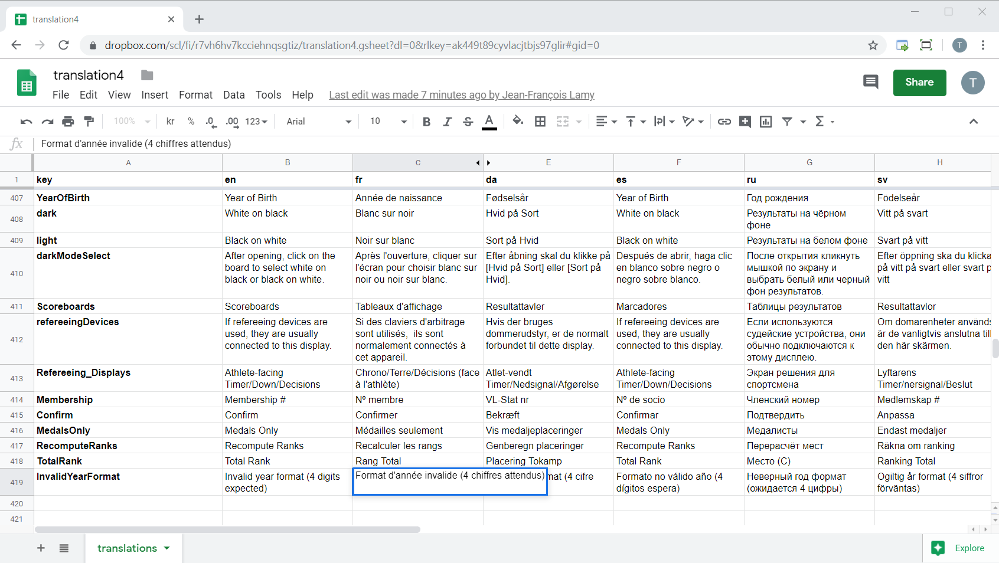
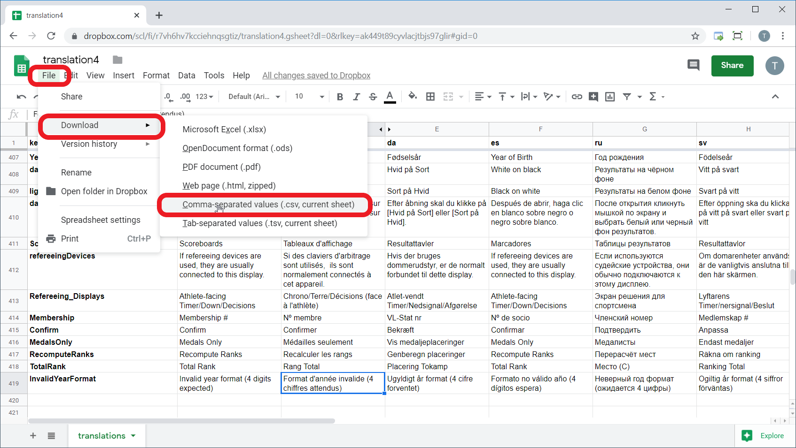
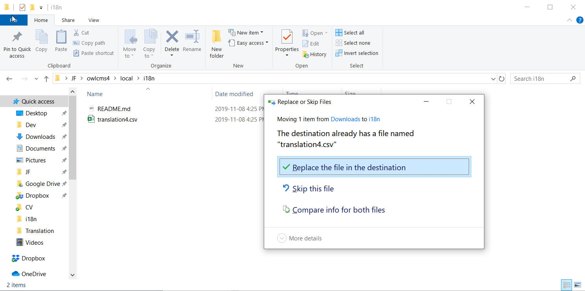

# Translation Instructions

## Translating the screens and displays

1. For translation, you need to install OWLCMS4 locally.  Refer to the [Local Setup instructions](https://jflamy.github.io/owlcms4/#/LocalSetup). 

2. Use the following link to locate the [Dropbox folder](https://www.dropbox.com/sh/3dzsbv02fgdrpp3/AAD-yKNcgiMzFOqQzv3qFTiFa?dl=0) that contains the master copy of the translations
    - Click on the file named `translation4.gsheet`
    - You will be prompted to login in order to edit. The simplest way to edit is to use a Google account (even if it's only for this purpose).  Log out of dropbox and login using the google account.  If you do not gain access, send an e-mail to jf@jflamy.dev for it to be granted.
3. Each column of `translation4.gsheet`represents a language.  
    - Add your own language by adding a column at the end; use the ISO 639-1 two-letter code for your language -- see the list in https://en.wikipedia.org/wiki/List_of_ISO_639-1_codes  (for example, da is Danish, fr is French, ru is Russian, etc.) 
    - You may  have variations per country. For example `fr_CA` is the code for French in Canada, where different words are used and some of the displays are bilingual.
4. Translate the strings in your language. Google sheets saves automatically.
    

## Testing your screen and display translations

5.  When ready to test, you need to download the translation file to your PC.  Use the `File` `Download` `Comma-separated values` option from the menu.

6. Use the `Show in folder` option on the downloaded file (or locate your Downloads folder) and <u>rename the file to `translation4.csv`</u>

   

7.  Copy or move the file to your local installation

   - Under Windows, [open your installation directory](https://jflamy.github.io/owlcms4/#/LocalSetup?id=accessing-the-program-files-and-configuration) and locate the `local\i18n`  folder (which stands for "internationalization" -- the word has 18 letters between i and n)
   - Under Mac OS and Linux, open where you unzipped the file, and find the `local/i18n` directory
   - Overwrite the file that is currently in the local/i18n location

8. Start the program as usual for your local setup

  - > The files that you have in your `local` directory will have precedence over the files shipped with OWLCMS4, so the translation file in `local -> i18n -> translation4.csv` will be used instead of the official one. 

  - Any string you have not translated will come out as `!xx: SomeCode`. This means that there is no value in the row `SomeCode` for the language `xx`.

9. If you update the file while the program is running, you can reload the file to see your changes by going to the bottom of the `About` screen and clicking on the reload button.  After reloading the translations you need to tell your browser to reload the pages from OWLCMS4 to see the new text (F5 or Ctrl-R or Right-Click depending on your browser)

- By default, OWLCMS4 obeys your browser settings.  So if your browser is set to have xx as the preferred language, and there are translations available for language `xx`, you will see the `xx` text you provided.
  - If you don't get the right language (for example, my browser is in English, but I need to see French when translating to French), see the [instructions for forcing the language](https://jflamy.github.io/owlcms4/#/LocalSetup?id=defining-the-language)

## Translating the Excel files
- Under the `local\templates` directory you will find the various Excel templates, in separate subdirectories
- For example, for athlete cards, you will need to copy `templates\Cards\CardTemplate_en.xls` to `templates\Cards\CardTemplate_xx.xls`  to translate it for language xx, where xx is the [ISO 639-1 code]( https://en.wikipedia.org/wiki/List_of_ISO_639-1_codes) for your language.
- Note: if the templates are not found in your language, the English version will be used.  So you don't have to translate all the templates, or even any template at all, if you are OK with the English version initially.

## Testing your Excel File Translations

- For the protocol and final package files where several formats are possible, the files are loaded when they are selected on the results and package pages.  To reload your file if you make changes, select another language, and then switch back to your own.
- For the other files (athlete cards, start list, etc.) there is only one choice per language, and there is no selection menu.  These files are read every time the document is produced.

## Reminder

If you are using the Windows installer, uninstalling will also delete the local directory.  **Make a copy before updating **

## Sending your translations back

Once you are happy with your `local` directory, send an e-mail to the author at [jf@jflamy.dev](mailto:jf@jflamy.dev) so the translations are copied to the software source repository.
