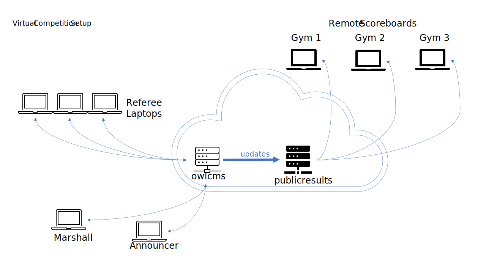

# Cloud-Based Virtual Competitions

In a virtual competition, the officials and athletes are in multiple locations.  

- In order to allow referees to see the athletes, a videoconferencing software is used. Zoom is well suited for this task. This also allows coaches to communicate declarations and weight changes.
- In order to allow access by all officials, `owlcms` is run in the cloud and supports remote refereeing -- see the following [page](Refereeing#Mobile-Device-Refereeing) for details. Remote referees need to use a laptop because a proper screen is needed for refereeing but unfortunately iPads do not support simultaneous use of video and of the refereeing application.

Two cloud-based applications are used.  The officials use owlcms.  A second application called publicresults makes the scoreboard available.  Because they run on two different computers, they can be scaled up independently.

The following pages will guide you through setting up a virtual competition. First, install and configure the applications:

1. [Setup Heroku for a Virtual Competition](HerokuLarge)

Once the application is installed, you can setup the video and broadcasting elements:

1. [Preparing the Zoom Setup](PrepareZoomBroadcasting)
2. [Preparing the Video Broadcasting Setup](OBS)
3. [Live Streaming Events](Streaming)
4. [Optional Modified Competition Rules](ModifiedRules)

If you wish to control the full setup and are technology-savvy, alternatives to using Heroku are possible, for example, [Kubernetes on Digital Ocean Cloud](DigitalOcean) or [Home Kubernetes Hosting with Secure Internet Access](k3d)

