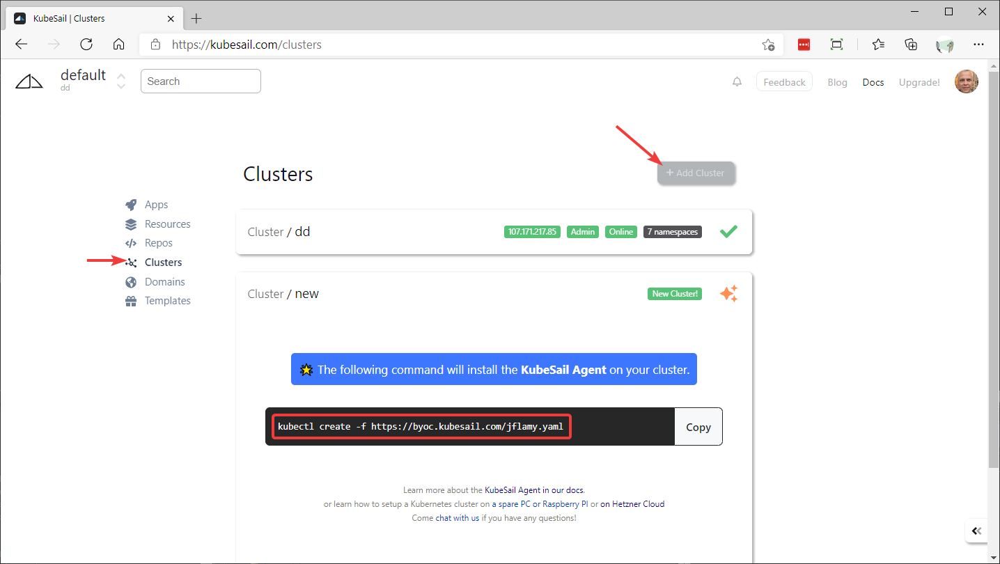
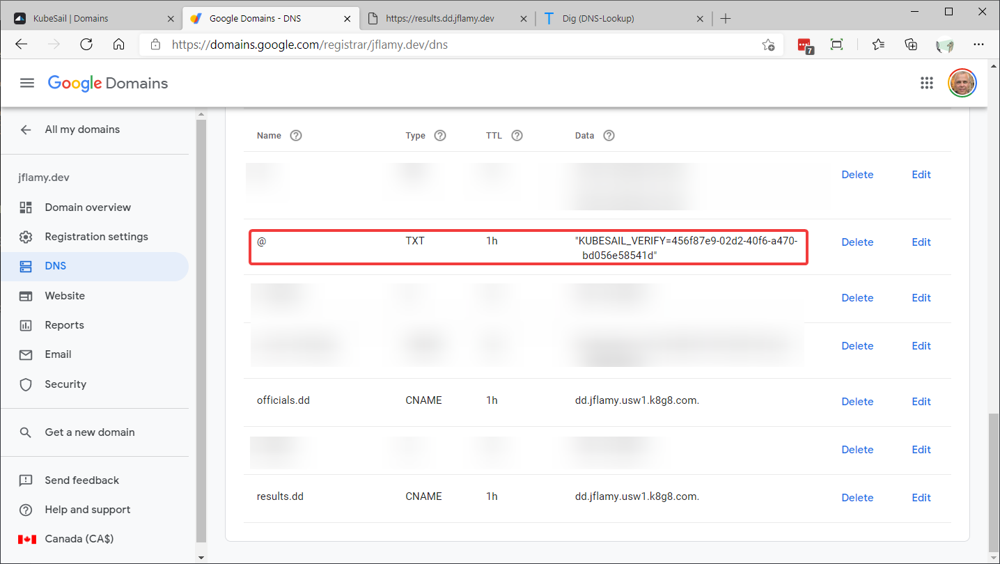
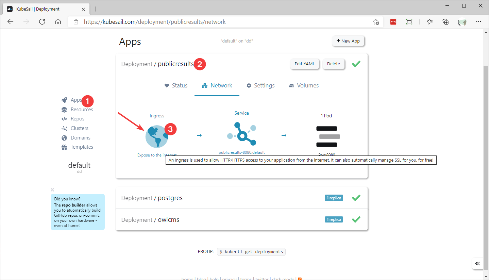

# Home Hosting with Secure Internet Access

As an alternative to Heroku suitable for larger competitions, this page explains how to run owlcms and publicresults on your own home computer, and make it available from the cloud.

This procedure uses the free tier of the https://kubesail.com service to make the program accessible from the cloud.  A moderately-priced paid tier enables use of more network transfer volume, if needed.

## Install docker

Install docker on Windows, Mac or Linux using the [instructions](https://docs.docker.com/get-docker/)

If running on Windows, use the following guidelines:

- Enable WSL2. The instructions are found [here](https://docs.docker.com/docker-for-windows/install-windows-home/). This step is only required once.  
- Check that Docker Desktop is integrated with WSL2 (it is enabled by default) 
- Do NOT Enable the built-in kubernetes support.  The next step installs a more flexible alternative.  

## Install k3d

Install k3d using the instructions from [the k3d documentation site](https://k3d.io/#installation)

For Windows we suggest: 

- The simplest option is to install k3d in your WSL2 distribution (the docker backend runs in WSL2, and k3d just remote controls the docker backend)
  - ```curl -s https://raw.githubusercontent.com/rancher/k3d/main/install.sh | bash```
- Also install k3d in your Windows environment for convenience -- this will make it easy to run other programs such as [Lens](https://k8slens.dev/) under Windows.  If you do not have Chocolatey installed, you can go to the [releases](https://github.com/rancher/k3d/releases) page and download `k3d-windows-amd64.exe`.  Rename the file to `k3d` and make it visible somewhere on your PATH.

## Create a k3d cluster

We disable the deployment of the default ingress controller, which will be replaced by the more common `nginx` ingress.

```bash
k3d cluster create owlcms --k3s-server-arg '--no-deploy=traefik'
```

> Note:  If you also want to be able to connect to your cluster locally, use this format to make connections on port 8443 possible.  This will be possible *after* we have connected the cluster to the internet and obtained correct certificates.  Since we use certificates, you will need to use https, hence the choice of a 443 port.  You can replace 8443 with whatever you want, including 443 if it is free
>
> ```bash
> k3d cluster create owlcms --k3s-server-arg '--no-deploy=traefik' --port "8443:443@loadbalancer"
> ```

We then save the configuration in our WSL2 Linux environment (in ~/.k3d).  The following command also sets the KUBECONFIG variable to the correct value.

```bash
export KUBECONFIG=$(k3d kubeconfig write owlcms)
```

If you installed on Windows, the following command will create the configuration file in a .k3d directory in your home directory.  You will be able to select that file when running Lens for example

```cmd
k3d kubeconfig write owlcms
```

## Enable remote access to the cluster

[KubeSail](https://kubesail.com) offers a free service that will enable you to connect your private cluster to the cloud.  Your cluster will connect to KubeSail using an *agent*.  This works without changing anything to your firewall (since it is the agent running on your home network that initiates the process).  The opposite would be much harder (opening your home firewall, your Windows firewall, your Docker, and finally your cluster).

1. Create yourself a https://kubesail.com account.  This will rely on GitHub to log you in, so you may need to create a free account there.  Beware that if you do not own an internet domain, the login you chose will be part of the URL people see, so you probably want something meaningful, such as your club or federation name.
2. Go to the Clusters page.  You will be given a command to install the agent.  Use the copy button to copy the command.
   
3. Paste the command in a command shell on your machine.
4. After a few seconds, the Cluster page will refresh and you will be asked to give a short name to your cluster.  This short name will be added to the front of a long name.  We suggest something meaningful like "owlcms" or your club name or federation name.
5. Go to the Domains section. Note the domain name that ends with `k8g8.com` for your cluster.  If you named your cluster `owlcms` this will be something like `owlcms.youraccount.usw1.k8g8.com`.

## Install owlcms

1. Https certificates are tied to the name we will use to access our site, and the kubernetes ingress configuration must know the names.  In order to simplify things, we use the default kubesail name for our cluster during the first setup.

   We need to define two names, one for the name that will be used by the officials, one for the name of the application used by the athletes and the public.  We add a prefix before the domain name.
   Type the following to your Linux shell (replace `youraccount` with your actual account name, obviously).  

```
export OFFICIALS=officials.owlcms.youraccount.usw1.k8g8.com
export RESULTS=results.owlcms.youraccount.usw1.k8g8.com
```

2. This step fetches the configuration and substitutes the values for OFFICIALS and RESULTS before applying it. 

```powershell
curl -sfL https://github.com/owlcms/owlcms4/releases/download/4.30.1-rc02/k3d_setup.yaml | envsubst | kubectl apply -f - 
```

> Note: you may have to execute the command several times, because some steps take time to complete.  There is no harm done repeating the steps.  Wait 30 seconds or so between each attempt, every attempt will get further down the steps.  This is simpler than breaking down the setup in several steps. 

## Using your own Internet Name

If you own your own internet name, you can now substitute it.

1. Go to the Domains tab of the KubeSail interface.  Locate the k8g8.com fully qualified name. <u>Important</u>: you want the `k8g8.com` name, and not the other ones.
   
2. Go to your DNS providers.  Create two CNAME records that point to the k8g8.com fully qualified name.
   
3. Go to the Domains tab on the KubeSail application.  Click the "Add a domain" button and follow the instructions.  This will require you to create a TXT record in your DNS manager.
   
4. After a little while, your domain should show up in the  Domains list as being verified.
5. You can now create the connection between the name and the application. KubeSail calls them "deployments" following Kubernetes usage.  Go to the Apps section of KubeSail and select a deployment. We will use publicresults for our example -- this is the application used by the public.
   
6. We select the name of our domain, and we use the subdomain name we defined earlier as a CNAME.  So the resulting URL will be `results.dd.jflamy.dev` in this example.
7. When we click "Save", KubeSail will apply the new definition, and our cluster is set up to request the certificate automatically using the LetsEncrypt service.  After about a minute, the URL should start working.
8. Repeat steps 4 to 6 for the other application `owlcms` deployment. In our example we would use the `officials.dd` CNAME.

## Updating the version

In order to update the application, repeat the installation step, but 

- use your actual domain names for the `export RESULTS` and `export OFFICIALS` value

- The latest release can always be reached using this format (note that the download part is inverted relative to the revision name for some unfathomable reason)

  ```bash
  curl -sfL https://github.com/owlcms/owlcms4-prerelease/releases/latest/download/k3d_setup.yaml | envsubst | kubectl apply -f - 
  ```

## Install Lens as Kubernetes Management Tool

Lens is a very useful tool to see the status of your cluster.

1. Download and install lens from [Lens | The Kubernetes IDE (k8slens.dev)](https://k8slens.dev/)
2. Create a cluster definition using the + at the left and select the configuration file in the `.k3d` folder in your home directory, i.e.  `%HOMEDRIVE%%HOMEPATH%\.k3d\k3d-owlcms.yaml`  if your cluster is called `owlcms` (use `~/.k3d/k3d-owlcms.yaml` under WSL2).
3. Right-click on the icon for your cluster, select `Settings` and scroll down to the `Metrics Stack` section.  Install Prometheus to get metrics.

Once you have defined your cluster, the Terminal window creates a shell that automatically uses the `KUBECONFIG` for that cluster, meaning that the `kubectl` commands will automatically go to that cluster.

## Backing up the database

In order to backup the database, you can use the `kubectl exec` command to reach the Postgres pod inside the cluster, as follows, using PowerShell, bash or Git-Bash.

```
kubectl exec $(kubectl get pods -l app=postgres --no-headers -o name) -- pg_dump -U owlcms -d owlcms_db
```

The part between `$()` is a sub-command that gets the name of the postgres pod, which is then substituted in the `kubectl exec` command.   You can add additional parameters to pg_dump to select the format you want.

