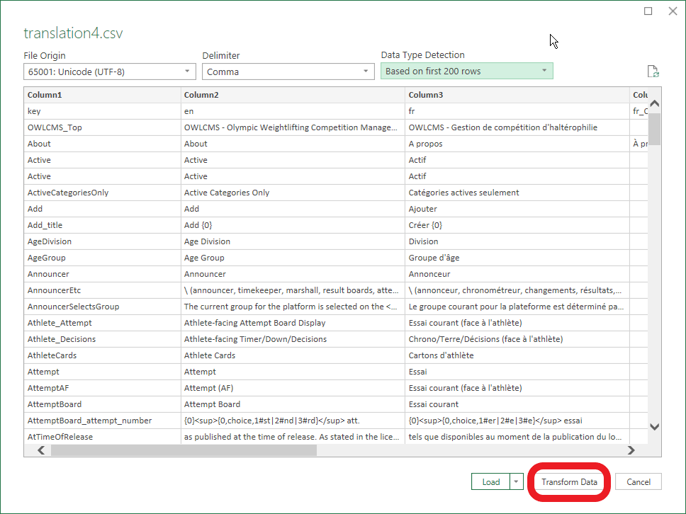

# Translation Instructions

## Translating the screens and displays

1. For translation, you need to install OWLCMS4 locally.  Refer to the [Local Setup instructions](https://jflamy.github.io/owlcms4/#/LocalSetup).  Once installed,
   - Under Windows, [open your installation directory](https://jflamy.github.io/owlcms4/#/LocalSetup?id=accessing-the-program-files-and-configuration) and find the `local\i18n`  folder (which stands for "internationalization" -- the word has 18 letters between i and n)
   - Under Mac OS and Linux, open where you unzipped the file, and find the `local/i18n` directory
   
2. Open the file `translation4.csv`using Excel or OpenOffice/LibreOffice by double-clicking on the file.
   
   The file uses the `UTF-8` international format for characters, the fields are delimited with a comma `,` and strings are quoted with straight double-quotes `"`.
   
    Depending on you configurations, either
   
   1. the file opens correctly, one language per column, and you see French, Danish, Russian characters on the second line. If so, <u>proceed to step 3</u>  OR
   2. Excel does not open the file -- see the instructions at the bottom of the page for possible workarounds.
   
3. Each column of `translation4.csv`represents a language.  You may add your own language by adding a column at the end; use the ISO 639-1 two-letter code for your language -- see the list in https://en.wikipedia.org/wiki/List_of_ISO_639-1_codes  (for example, da is Danish, fr is French, ru is Russian, etc.)

   You may even have variations per country. For example `fr_CA` is the code for French in Canada, where different words are used and some of the displays are bilingual.

4. Critical: When SAVING you will need to make sure to use the "UTF-8 CSV" option

   - For Excel, if you do a Save As you should see the CSV UTF-8 option

   

   - For OpenOffice/LibreOffice, you will have to [select specific options when saving](https://csvimproved.com/support/questions-and-answers/916-save-a-csv-file-as-utf-8)

## Testing your screen and display translations

   1. Add a column for your language in the .csv 

   2. Translate a few items by filling in the cells in the csv and save it.

   3. Start the program as usual for your local setup

         - The files that you have in your `local` directory will have precedence over the files shipped with OWLCMSS4, so your translation4.csv will be used instead of the official one
- By default, OWLCMS4 obeys your browser settings.  So if your browser is set to have xx as the preferred language, and there are translations available for language xx, you will see the xx text you provided.  If you don't get the right language (for example, my browser is in English, which does not help when translating to French), see the [instructions for forcing the language](https://jflamy.github.io/owlcms4/#/LocalSetup?id=defining-the-language)
         - Any string you have not translated will come out as `!xx: SomeCode`
  This means that there is no value in the row `SomeCode` for the language `xx`
         - If you change the translation file, you have to restart the program to see the changes (at present, this may change in the future)

## Translating the Excel files
- Under the `local\templates` directory you will find the various Excel templates, in separate subdirectories
- For example, for athlete cards, you will need to copy `templates\Cards\CardTemplate_en.xls` to `templates\Cards\CardTemplate_xx.xls`  to translate it for language xx, where xx is the [ISO 639-1 code]( https://en.wikipedia.org/wiki/List_of_ISO_639-1_codes) for your language.
- Note: if the templates are not found in your language, the English version will be used.  So you don't have to translate all the templates, or even any template at all, if you are OK with the English version initially.

## Testing your Excel File Translations

- For the protocol and final package files where several formats are possible, the files are loaded when they are selected on the results and package pages.  To reload your file if you make changes, select another language, and then switch back to your own.
- For the other files (athlete cards, start list, etc.) there is only one choice per language, and there is no selection menu.  These files are read every time the document is produced.

## Sending your translations back

Once you are happy with your `local` directory, and either

- Open an issue on github and attach your translation as an enhancement request.

- or send an e-mail to the author to [jf@jflamy.dev](mailto:jf@jflamy.dev)

------

## *Workaround to force Excel to Read a UTF-8 CSV*

<u>This is only needed if Excel cannot read your file initially</u>

1. Open Excel from the start menu -- do NOT double-click on the file

2. Use the Data / From Text/CSV option to open the file

   

3. A wizard will run and detect the settings. Unfortunately, it cannot guess that the top line is used as a header line, so we click `Transform Data` at the bottom.

3. Select the `Use first row as headers` option
   
4. Select `Close and Load` to reload with the header line
   
5. Go to the Design menu and select `Convert to Range` to go back to normal Excel style.  You may close the Queries and Connections panel at the right by clicking X
   
6. Critical: When SAVING make sure to use "Save As" and use the "UTF-8 CSV" option
   